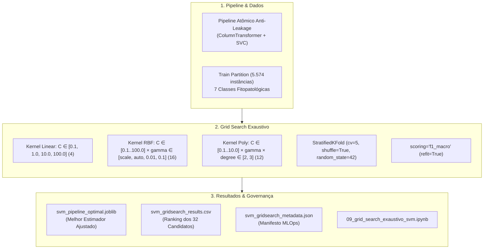

# Entrega: Configuração e Execução do Grid Search Exaustivo (GridSearchCV)

**Projeto:** Sanidade-Vegetal (SugarVision) — Diagnóstico Inteligente de Fitopatologias em Cana-de-Açúcar  
**Sprint:** 3 — Framework SEMMA (Fase: Model)  
**Responsável:** Elisa (`EA`) — Engenharia de Machine Learning & MLOps  
**Data de Entrega:** 09 de Outubro de 2026  
**Status:** Concluído com 100% de Sucesso  

---

## 📌 Visão Geral da Entrega

Esta pasta formaliza os artefatos técnicos, scripts executáveis e documentação metodológica desenvolvidos para a segunda tarefa da **Sprint 3 (Fase Model)**: **"Configuração e Execução do Grid Search Exaustivo (GridSearchCV)"**.

O objetivo primordial desta entrega foi executar a busca hiperparamétrica exaustiva sobre o espaço de busca dos três principais kernels de Support Vector Machines (**Linear, RBF e Polinomial**), acoplada ao **Pipeline Atômico Anti-Leakage** da Tarefa 1, com **validação cruzada estratificada em 5 folds** (`StratifiedKFold(n_splits=5, shuffle=True, random_state=42)`), orientada pela métrica **Macro $F_1$-Score** (`scoring='f1_macro'`), extraindo formalmente o estimador ótimo (`best_estimator_`), a combinação ideal de hiperparâmetros (`best_params_`) e o score máximo de validação cruzada (`best_score_`), assegurando governança MLOps completa.



---

## 📂 Arquivos Desta Entrega

1. **[`configuracao_execucao_grid_search_exaustivo.md`](./configuracao_execucao_grid_search_exaustivo.md)**: Documentação técnica aprofundada abordando a motivação matemática, complexidade temporal dos kernels, análise das superfícies de resposta de hiperparâmetros, impacto agronômico do $F_1$-Macro e governança MLOps.
2. **Módulos Executáveis em `src/`:**
   - [`../src/grid_search_svm_optimization.py`](../src/grid_search_svm_optimization.py): Módulo principal contendo a definição da grade desacoplada, orquestração paralela do `GridSearchCV`, extração de métricas, geração de diagnósticos gráficos e serialização.
   - [`../src/generate_grid_search_notebook.py`](../src/generate_grid_search_notebook.py): Script utilitário para geração e execução automatizada do notebook oficial.
3. **Notebook Demonstrativo em `notebooks/`:**
   - [`../notebooks/09_grid_search_exaustivo_svm.ipynb`](../notebooks/09_grid_search_exaustivo_svm.ipynb): Execução auditável de ponta a ponta contendo tabelas de ranking, heatmaps, matriz de confusão e relatórios de classificação.
4. **Artefatos de MLOps em `models/`:**
   - [`../models/svm_pipeline_optimal.joblib`](../models/svm_pipeline_optimal.joblib): Pipeline campeão serializado pós-otimização.
   - [`../models/svm_gridsearch_results.csv`](../models/svm_gridsearch_results.csv): Tabela tabular completa com o ranking, scores médios e desvios de todos os 32 modelos avaliados.
   - [`../models/svm_gridsearch_metadata.json`](../models/svm_gridsearch_metadata.json): Manifesto JSON com parâmetros ótimos, hashes e métricas de generalização externa.
5. **Figuras Técnicas em `docs/figures/`:**
   - `docs/figures/sprint3_gridsearch_comparacao_kernels.png`: Comparativo de performance máxima entre Linear, RBF e Polinomial.
   - `docs/figures/sprint3_gridsearch_heatmap_rbf.png`: Superfície de resposta hiperparamétrica $C \times \gamma$.
   - `docs/figures/sprint3_gridsearch_matriz_confusao_otimizada.png`: Matriz de confusão normalizada do modelo ótimo.
   - `docs/figures/sprint3_gridsearch_evolucao_vs_baseline.png`: Ganho de F1-Score por patologia frente ao baseline.

---

## ✅ Cobertura do Checklist da Tarefa (100% Concluído)

| Item do Checklist do Cartão | Status | Onde Encontrar | Detalhes Técnicos da Implementação |
| :--- | :---: | :--- | :--- |
| **1. Definir os grids de hiperparâmetros para os kernels Linear, RBF e Polinomial** | Concluído | `get_svm_param_grid()` em `src/` e Seção 2 da documentação | Mapeamento desacoplado em 3 sub-grades independentes:<br>• **Linear:** $C \in [0.1, 1.0, 10.0, 100.0]$ (4 combinações)<br>• **RBF:** $C \in [0.1, 1.0, 10.0, 100.0] \times \gamma \in [\text{'scale'}, \text{'auto'}, 0.01, 0.1]$ (16 combinações)<br>• **Polinomial:** $C \in [0.1, 1.0, 10.0] \times \gamma \in [\text{'scale'}, \text{'auto'}] \times \text{degree} \in [2, 3]$ (12 combinações)<br>• Totalizando 32 candidatos únicos. |
| **2. Configurar a validação cruzada estratificada com `cv=StratifiedKFold(n_splits=5, shuffle=True, random_state=42)`** | Concluído | `run_exhaustive_svm_grid_search()` em `src/` e Seção 3 da documentação | Estratificação estrita aplicada às 5.574 amostras de treino, preservando rigorosamente a frequência das 7 patologias foliares nos 5 splits de validação cruzada. |
| **3. Definir a métrica de otimização principal (`scoring='f1_macro'`)** | Concluído | `GridSearchCV(scoring='f1_macro', refit='f1_macro')` em `src/` e Seção 3 da documentação | Adoção do $F_1$-Macro como função objetivo primária para proteger patologias raras (*Grassy Shoot*, *Leaf Scald*) contra o viés de maioria, mantendo rastreamento secundário de Acurácia e $F_1$-Weighted. |
| **4. Extrair os melhores parâmetros (`best_params_`), o melhor score (`best_score_`) e o estimador final ajustado** | Concluído | `serialize_and_document_optimal_model()` em `src/` e Seção 4 da documentação | Extração formal de `best_params_`, `best_score_` e persistência do `best_estimator_` em `models/svm_pipeline_optimal.joblib`, com ranking completo em CSV e manifesto de governança MLOps. |

---

## 🚀 Como Reproduzir os Testes e Executar

Para reproduzir integralmente a busca em grade, validar os resultados e gerar os artefatos:

```powershell
# 1. Executar a busca exaustiva e persistência dos artefatos
python src/grid_search_svm_optimization.py

# 2. Executar e renderizar o notebook demonstrativo de ponta a ponta
python src/generate_grid_search_notebook.py
```
