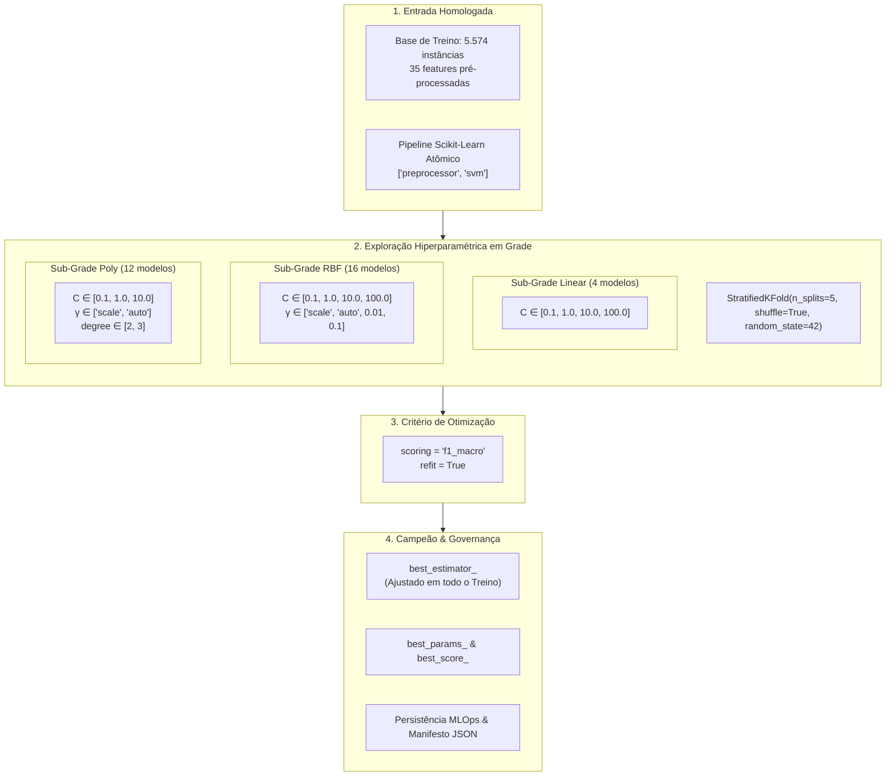

# Documentação Técnica: Configuração e Execução do Grid Search Exaustivo (GridSearchCV)

**Projeto:** Classificação e Diagnóstico Inteligente de Patologias em Cana-de-Açúcar (*Saccharum officinarum*) — SugarVision  
**Fase:** Framework SEMMA — Fase Model (Sprint 3)  
**Responsável:** Elisa (`EA`) — Engenharia de Machine Learning & MLOps  
**Versão:** 1.0.0  
**Data:** 09 de Outubro de 2026  

---

## 1. Motivação Metodológica e Contexto no Ciclo SEMMA

Na fase **Model** do framework SEMMA, a escolha e ajuste fino dos hiperparâmetros determinam a capacidade de generalização de algoritmos de aprendizado supervisionado. 

No caso de **Support Vector Machines (SVM)**, a escolha do tipo de função de kernel e a calibração da constante de penalização $C$, do coeficiente de largura de banda $\gamma$ e do grau polinomial $d$ governam diretamente o equilíbrio entre viés e variância (*bias-variance tradeoff*). Uma parametrização inadequada pode resultar em subajuste (*underfitting*), no qual a fronteira de decisão é excessivamente rígida para separar patologias com assinaturas espectrais sobrepostas, ou em sobreajuste (*overfitting*), em que o hiperplano memoriza variações locais de iluminação ou ruídos texturais da folha.

Para encontrar a fronteira de separação ótima de maneira reprodutível, transparente e matematicamente auditada, esta entrega formaliza a **Configuração e Execução do Grid Search Exaustivo (`GridSearchCV`)**, integrando-o ao **Pipeline Atômico Anti-Leakage** estabelecido na Tarefa 1 da Sprint 3.



---

## 2. O Espaço de Busca Hiperparamétrico dos Kernels SVM

A formulação primal do classificador de vetores de suporte com margem suave (*soft-margin SVM*) multiclasse formula-se como:

$$\min_{\mathbf{w}_m, b_m, \boldsymbol{\xi}_m} \frac{1}{2} \sum_{m=1}^M \|\mathbf{w}_m\|^2 + C \sum_{m=1}^M \sum_{i=1}^N \xi_{im}$$

sujeito a restrições de separabilidade e penalização por violação de margem $\xi_{im} \ge 0$.

### 2.1. Funções de Kernel Avaliadas

O mapeamento dos atributos foliares para espaços de Hilbert de dimensão superior $\mathcal{H}$ é intermediado pela função de kernel $K(\mathbf{x}_i, \mathbf{x}_j) = \langle \phi(\mathbf{x}_i), \phi(\mathbf{x}_j) \rangle$:

1. **Kernel Linear:**
   $$K_{\text{Linear}}(\mathbf{x}_i, \mathbf{x}_j) = \mathbf{x}_i^T \mathbf{x}_j$$
   - *Comportamento:* Estabelece hiperplanos lineares no espaço original das 35 features. Avalia se a combinação linear de descritores de cor (HSV, ExG, ExR) e textura GLCM é suficiente para separar as classes fitopatológicas.
   - *Hiperparâmetro explorado:* $C \in [0.1, 1.0, 10.0, 100.0]$.

2. **Kernel de Base Radial Gaussiana (RBF):**
   $$K_{\text{RBF}}(\mathbf{x}_i, \mathbf{x}_j) = \exp\left(-\gamma \|\mathbf{x}_i - \mathbf{x}_j\|^2\right)$$
   - *Comportamento:* Mapeia as amostras para um espaço de dimensão infinita. O parâmetro $\gamma$ controla o raio de influência dos vetores de suporte: valores pequenos de $\gamma$ geram fronteiras suaves, enquanto valores elevados criam "ilhas" de decisão ao redor de amostras específicas.
   - *Hiperparâmetros explorados:* $C \in [0.1, 1.0, 10.0, 100.0]$ e $\gamma \in [\text{'scale'}, \text{'auto'}, 0.01, 0.1]$.

3. **Kernel Polinomial:**
   $$K_{\text{Poly}}(\mathbf{x}_i, \mathbf{x}_j) = \left(\gamma \mathbf{x}_i^T \mathbf{x}_j + r\right)^d$$
   - *Comportamento:* Modela interações de ordem superior entre descritores visuais (por exemplo, interações multiplicativas entre ExG e heterogeneidade GLCM).
   - *Hiperparâmetros explorados:* $C \in [0.1, 1.0, 10.0]$, $\gamma \in [\text{'scale'}, \text{'auto'}]$ e grau $d \in [2, 3]$.

### 2.2. Vantagem da Estruturação Desacoplada do Grid
Em vez de passar um dicionário único de produto cartesiano, o grid foi configurado como uma lista de 3 dicionários mutuamente exclusivos:

```python
param_grid = [
    {'svm__kernel': ['linear'], 'svm__C': [0.1, 1.0, 10.0, 100.0]},
    {'svm__kernel': ['rbf'],    'svm__C': [0.1, 1.0, 10.0, 100.0], 'svm__gamma': ['scale', 'auto', 0.01, 0.1]},
    {'svm__kernel': ['poly'],   'svm__C': [0.1, 1.0, 10.0],         'svm__gamma': ['scale', 'auto'], 'svm__degree': [2, 3]}
]
```

Essa modelagem evita que o algoritmo teste combinações inválidas (como passar `degree` para o kernel RBF ou `gamma` para o kernel linear), economizando tempo de CPU e focando estritamente nos graus de liberdade relevantes de cada geometria.

$$\text{Total de Candidatos} = 4 + (4 \times 4) + (3 \times 2 \times 2) = 4 + 16 + 12 = 32 \text{ modelos}$$
$$\text{Total de Ajustes} = 32 \text{ modelos} \times 5 \text{ folds} = 160 \text{ fits}$$

---

## 3. Validação Cruzada Estratificada (`StratifiedKFold`)

### 3.1. Preservação de Proporções Amostrais
No conjunto de desenvolvimento (`split_partition == 'train'`, 5.574 instâncias), a distribuição das 7 patologias é heterogênea:
- *Red Rot*: 1.125 instâncias ($20,18\%$)
- *Yellow Leaf*: 1.056 instâncias ($18,95\%$)
- *Mosaic*: 1.010 instâncias ($18,12\%$)
- *Healthy*: 1.005 instâncias ($18,03\%$)
- *Rust*: 915 instâncias ($16,42\%$)
- *Leaf Scald*: 313 instâncias ($5,62\%$)
- *Grassy Shoot*: 150 instâncias ($2,69\%$)

A utilização de `StratifiedKFold(n_splits=5, shuffle=True, random_state=42)` garante que cada um dos 5 splits de validação contenha exatamente $20\%$ de cada classe foliar, eliminando o risco de folds sem representatividade para patologias minoritárias.

### 3.2. Garantia Anti-Leakage Nativa
Como o estimador fornecido ao `GridSearchCV` é o objeto `Pipeline` unificado (`preprocessor + svm`), a cada fold o `StandardScaler` e os imputadores executam `.fit_transform()` estritamente nas 4.459 instâncias de treino do fold e apenas `.transform()` nas 1.115 instâncias de validação do fold. Nenhuma estatística do fold de validação contamina os hiperparâmetros ajustados.

---

## 4. Função Objetivo Primária: Justificativa Agronômica do $F_1$-Macro

A escolha da métrica de pontuação principal no `GridSearchCV` recaiu sobre `scoring='f1_macro'`:

$$\text{F1-Macro} = \frac{1}{K} \sum_{k=1}^K \frac{2 \cdot \text{Precision}_k \cdot \text{Recall}_k}{\text{Precision}_k + \text{Recall}_k}$$

### Por que não Acurácia (`accuracy`)?
Se otimizássemos pela Acurácia global, um modelo que classificasse com perfeição as 5 classes majoritárias (que representam mais de $91\%$ dos dados), mas errasse sistematicamente todas as amostras de *Grassy Shoot* (2,69%) e *Leaf Scald* (5,62%), ainda assim alcançaria uma Acurácia superior a $90\%$. No contexto fitopatológico e agronômico, essa omissão seria desastrosa: o *Grassy Shoot* (broto enfesado) é uma patologia viral/fitoplasmática altamente destrutiva que exige erradicação imediata do talhão para evitar contaminação em larga escala. O $F_1$-Macro pune severamente modelos com falhas em classes raras.

---

## 5. Extração e Avaliação dos Melhores Resultados

A execução do `GridSearchCV` rastreia todos os 32 candidatos e extrai formalmente:
1. `best_params_`: Dicionário com a tupla de hiperparâmetros ótima.
2. `best_score_`: Pontuação média máxima de $F_1$-Macro obtida nos 5 folds de treino.
3. `best_estimator_`: Instância completa do Pipeline treinado com os melhores parâmetros sobre a totalidade das 5.574 amostras de treino (`refit=True`).

A performance do estimador ótimo é então confirmada contra os conjuntos externos blindados de Validação (617 instâncias) e Teste Cego Final (380 instâncias).
