# Entrega: Consolidação e Exportação da ABT Final (abt_features_modelagem)

**Projeto:** Sanidade-Vegetal (SugarVision)  
**Sprint:** 2 — Framework SEMMA (Fase: Modify)  
**Responsável:** Elisa (`EA`) — Engenharia de Machine Learning & MLOps  
**Data de Entrega:** 22 de Setembro de 2026  
**Status:** Concluído com 100% de Sucesso  

---

## 📌 Visão Geral da Entrega

Esta pasta formaliza os artefatos técnicos, relatórios de auditoria e rotinas de automação desenvolvidos para a tarefa de **Consolidação e Exportação da ABT Final (abt_features_modelagem)**, de responsabilidade de **Elisa (`EA`)** no fechamento da **Sprint 2 (Fase Modify)**.

O objetivo central foi processar integralmente o corpus de **6.571 instâncias**, consolidar a **Tabela Analítica Base (ABT) definitiva de modelagem**, validar formalmente a **ausência absoluta de valores ausentes (0 NaNs em 100% das 40 colunas)** e persistir em formatos de alta performance (**Apache Parquet** colunar com compressão Snappy e **CSV** para interoperabilidade), acompanhado de manifesto criptográfico de integridade com hashes SHA-256 e validação contratual de prontidão para a **Sprint 3 (Modelagem Supervisionada com SVM e GridSearchCV)**.

```mermaid
flowchart LR
    subgraph IN["1. Processamento"]
        RAW["data/processed/abt_sanidade_vegetal.csv\n(6.571 instâncias x 35 colunas)"]
        PIPE["ColumnTransformer Atômico\n(models/preprocessor_pipeline.joblib)"]
    end

    subgraph AUDIT["2. Auditoria Rigorosa"]
        ZERO_NAN["0 NaNs / Nulls (40 colunas)"]
        PARTS["Treino: 5.574 | Validação: 617 | Teste: 380"]
        TARGETS["Binário: 1.146 Sadias / 5.425 Doentes\nMulticlasse: 7 patologias"]
    end

    subgraph OUT["3. Formatos Persistidos"]
        PQ["abt_features_modelagem.parquet\n(916,92 KB | 3,26x menor)"]
        CSV["abt_features_modelagem.csv\n(2.989,66 KB)"]
        JSON["abt_features_modelagem_manifest.json\n(Hashes SHA-256)"]
    end

    RAW --> PIPE
    PIPE --> AUDIT
    AUDIT --> OUT
```



---

## 📂 Arquivos Desta Entrega

1. **[`consolidacao_exportacao_abt_final.md`](./consolidacao_exportacao_abt_final.md)**: Documentação técnica aprofundada contendo dicionário das 40 colunas consolidadas, auditoria de qualidade, benchmark comparativo de I/O (Parquet vs CSV), hashes SHA-256 e contrato de integração com `GridSearchCV`.
2. **Módulos Executáveis em `src/`:**
   - [`../src/export_final_modeling_abt.py`](../src/export_final_modeling_abt.py): Script de consolidação, auditoria automatizada, benchmark e teste de fumaça de modelagem.
   - [`../src/generate_export_abt_notebook.py`](../src/generate_export_abt_notebook.py): Gerador e executor automatizado do notebook demonstrativo.
3. **Notebook Demonstrativo em `notebooks/`:**
   - [`../notebooks/07_consolidacao_exportacao_abt_final.ipynb`](../notebooks/07_consolidacao_exportacao_abt_final.ipynb): Notebook executado de ponta a ponta com carga Parquet, benchmark de I/O e simulação prática de `GridSearchCV`.
4. **Bases Tratadas e Manifesto em `data/processed/`:**
   - `data/processed/abt_features_modelagem.parquet`: Tabela definitiva em Apache Parquet (**916,92 KB**).
   - `data/processed/abt_features_modelagem.csv`: Versão em CSV para auditoria tabular (**2.989,66 KB**).
   - `data/processed/abt_features_modelagem_manifest.json`: Manifesto de auditoria com hashes SHA-256, schema e estatísticas.

---

## ✅ Cobertura do Checklist da Tarefa (100% Concluído)

| Item do Checklist do Cartão | Status | Onde Encontrar | Detalhes da Implementação |
| :--- | :---: | :--- | :--- |
| **1. Executar o pipeline de pré-processamento sobre a base completa com divisão determinística** | Concluído | Seção 1 de [`consolidacao_exportacao_abt_final.md`](./consolidacao_exportacao_abt_final.md) e `src/` | Processamento das 6.571 instâncias com `.fit_transform()` exclusivo no treino (5.574) e `.transform()` replicado em validação (617) e teste (380), sem vazamento de dados. |
| **2. Validar ausência de valores null/NaN e integridade das colunas preditivas e alvo** | Concluído | Seção 2 de [`consolidacao_exportacao_abt_final.md`](./consolidacao_exportacao_abt_final.md) e `src/` | Suíte de testes automatizados confirmando exatamente **0 valores ausentes (NaN)** nas 40 colunas, unicidade de `sample_id` e integridade das 7 classes fitopatológicas. |
| **3. Salvar a base tratada em formato Apache Parquet (`abt_features_modelagem.parquet`) e CSV** | Concluído | Seção 3 de [`consolidacao_exportacao_abt_final.md`](./consolidacao_exportacao_abt_final.md) e `src/` | Exportação dual persistida com sucesso em `data/processed/`. O Parquet apresentou compressão Snappy **3,26x mais compacta** e leitura **1,41x mais rápida** que o CSV. |
| **4. Documentar o hash de integridade e o volume final de linhas e colunas geradas** | Concluído | Seção 4 de [`consolidacao_exportacao_abt_final.md`](./consolidacao_exportacao_abt_final.md) e manifesto | Registro formal dos hashes SHA-256 no manifesto `abt_features_modelagem_manifest.json`. Dimensões: **6.571 linhas x 40 colunas**. |
| **5. Garantir que o artefato esteja 100% pronto para ser consumido pelo GridSearchCV na Sprint 3** | Concluído | Seção 5 de [`consolidacao_exportacao_abt_final.md`](./consolidacao_exportacao_abt_final.md) e `notebooks/` | Implementação de *smoke test* funcional integrando `PredefinedSplit`, `SVC(kernel='rbf')` e `GridSearchCV`, validando conformidade contratual sem erros. |

---

## 🚀 Como Reproduzir os Testes e Gerar os Artefatos

```powershell
# 1. Executar consolidação, auditorias e emissão do manifesto
py -3.12 src/export_final_modeling_abt.py

# 2. Executar e validar o notebook demonstrativo
py -3.12 src/generate_export_abt_notebook.py
```
