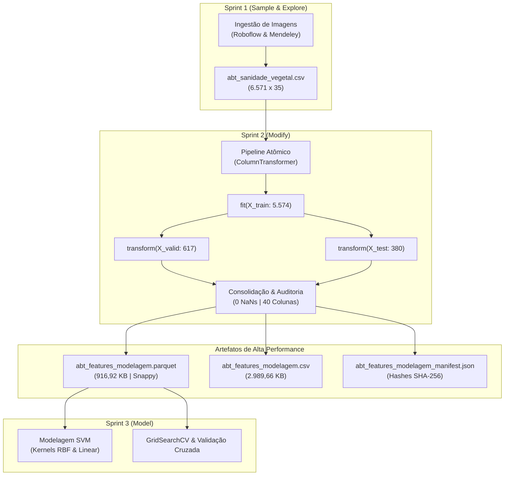

# Documentação Técnica: Consolidação e Exportação da ABT Final (`abt_features_modelagem`)

**Projeto:** Classificação e Diagnóstico Inteligente de Patologias em Cana-de-Açúcar (*Saccharum officinarum*) — SugarVision  
**Fase:** Framework SEMMA — Fechamento da Fase Modify (Sprint 2)  
**Responsável:** Elisa (`EA`) — Engenharia de Machine Learning & MLOps  
**Versão:** 1.0.0  
**Data:** Setembro de 2026  

---

## 1. Contextualização e Enquadramento Metodológico

Esta documentação consolida o fechamento da **Fase Modify** do framework SEMMA (*Sample, Explore, Modify, Model, Assess*) no projeto SugarVision. 

Após a extração de atributos cromáticos ($ExG$, HSV, $R/G$), descritores texturais de Haralick via GLCM, discretização estatística de metadados em faixas e estruturação do **Pipeline Atômico com `ColumnTransformer`**, a base analítica completa de **6.571 instâncias** foi integralmente processada com prevenção estrita de vazamento de dados (*Anti-Leakage*).

A tabela resultante foi batizada de **`abt_features_modelagem`** e persistida nos formatos **Apache Parquet** e **CSV**, servindo como fonte única da verdade (*Single Source of Truth*) para os experimentos de calibração de hiperparâmetros com `GridSearchCV` e modelos de Support Vector Machines (SVM) na **Sprint 3 (Fase Model)**.



---

## 2. Taxonomia e Dicionário de Dados da ABT Final (40 Colunas)

A base final unifica em uma estrutura tabular plana os **metadados e alvos preservados** e as **35 features preditivas normalizadas e codificadas**:

### 2.1. Metadados de Controle e Alvos Supervisionados (5 Colunas)

| Coluna | Tipo de Dado | Função no Dataset | Descrição e Valores |
| :--- | :---: | :---: | :--- |
| `sample_id` | `string (UUID)` | Chave Primária | Identificador universal e imutável de cada imagem fotográfica. |
| `split_partition` | `string (Categorical)` | Controle Experimental | Partição determinística: `train` (5.574), `valid` (617), `test` (380). |
| `class_label` | `string (Nominal)` | Rótulo da Classe | Nome textual da classe: `HEALTHY`, `RUST`, `RED ROT`, `MOSAIC`, `YELLOW LEAF`, `LEAF SCALD`, `GRASSY SHOOT`. |
| `target_binary` | `int64 {0, 1}` | Target Supervisionado | Diagnóstico binário: $0 = \text{Folha Sadia}$ (1.146 amostras), $1 = \text{Folha Doente}$ (5.425 amostras). |
| `target_multiclass` | `int64 [0..6]` | Target Supervisionado | Codificação ordinal das 7 patologias foliares. |

### 2.2. Features Preditivas Numéricas Normalizadas (17 Colunas — Padronização Z-Score)

Todas as features numéricas contínuas passaram por imputação de mediana e `StandardScaler(μ=0, σ=1)` ajustado no treino:
1. `mean_hue`: Matiz angular médio foliar no espaço HSV.
2. `std_saturation`: Variabilidade da saturação cromática foliar.
3. `exg_index`: Índice de Excesso de Verde foliar ($2G - R - B$).
4. `exr_index`: Índice de Excesso de Vermelho foliar ($1.4R - G$).
5. `rg_ratio`: Razão espectral $R/G$ sensível a clorose e lesões necrosadas.
6. `indice_clorose_necrose`: Razão espectral normalizada $(R - G) / (R + G + \epsilon)$.
7. `hue_dispersion`: Dispersão angular circular de matiz.
8. `glcm_contrast`: Contraste textural Haralick local na vizinhança de pixels.
9. `glcm_homogeneity`: Homogeneidade textural Haralick da superfície foliar.
10. `glcm_dissimilarity`: Dissimilaridade textural média da folha.
11. `glcm_energy`: Segundo Momento Angular / Uniformidade energética.
12. `indice_rugosidade_pustula`: Razão Contraste/Homogeneidade para detecção de pústulas de Ferrugem.
13. `laplacian_var`: Variância do filtro Laplaciano (métrica objetiva de nitidez/foco).
14. `size_kb`: Tamanho físico da imagem original em kilobytes.
15. `total_pixels`: Área total da fotografia em pixels ($Width \times Height$).
16. `resolution_mp`: Resolução fotográfica em Megapixels.
17. `aspect_ratio`: Proporção de aspecto geométrica ($Width / Height$).

### 2.3. Features Preditivas Categóricas Codificadas (18 Colunas — One-Hot Encoding)

Codificadas via `OneHotEncoder(sparse_output=False, handle_unknown='ignore')`:
- **Origem do Dataset (2 colunas):**
  - `dataset_source_mendeley_data`: Flag binária para amostras originárias do Mendeley Data.
  - `dataset_source_roboflow_sugarcane`: Flag binária para amostras do Roboflow Universe.
- **Formato Físico (2 colunas):**
  - `extension_.jpeg`: Flag para formato de arquivo JPEG.
  - `extension_.jpg`: Flag para formato de arquivo JPG.
- **Faixas de Tamanho do Arquivo (4 colunas):**
  - `size_kb_bin_0` a `size_kb_bin_3`: Quartis de peso de arquivo (*Muito Leve, Leve, Moderado, Pesado*).
- **Faixas de Nitidez e Foco (4 colunas):**
  - `laplacian_var_bin_0` a `laplacian_var_bin_3`: Quartis de nitidez (*Foco Fraco, Moderado, Alto, Ultra*).
- **Faixas de Resolução (3 colunas):**
  - `resolution_bin_0` a `resolution_bin_2`: Tiers de resolução (*Baixa 640px, Média HD, Alta DSLR*).
- **Faixas de Proporção de Aspecto (3 colunas):**
  - `aspect_ratio_bin_0` a `aspect_ratio_bin_2`: Enquadramento (*Retrato, Quadrado, Paisagem*).

---

## 3. Relatório de Auditoria de Qualidade e Integridade

A auditoria foi executada pelo script [`src/export_final_modeling_abt.py`](../src/export_final_modeling_abt.py) com os seguintes resultados formais:

```text
================================================================================
AUDITORIA ESTRITA DE QUALIDADE E INTEGRIDADE DA ABT FINAL
================================================================================
* Volumetria: 6571 linhas x 40 colunas.
  [OK] Dimensões conformes: exatamente 6.571 instâncias x 40 colunas.
* Total de valores nulos (NaN/None): 0
  [OK] Ausência total de valores ausentes (0 NaNs em 100% das colunas).
  [OK] Unicidade de identificadores de amostra (6.571 IDs únicos).
* Distribuição por split_partition: {'train': 5574, 'valid': 617, 'test': 380}
  [OK] Partições experimentais 100% aderentes à amostragem estratificada.
* Distribuição das 7 classes fitopatológicas:
  - RED ROT      : 1268 (19.29%)
  - MOSAIC       : 1257 (19.13%)
  - YELLOW LEAF  : 1198 (18.23%)
  - HEALTHY      : 1146 (17.44%)
  - RUST         : 1057 (16.09%)
  - LEAF SCALD   :  439 ( 6.68%)
  - GRASSY SHOOT :  206 ( 3.14%)
* Target binário (0=Sadia, 1=Doente): {0: 1146 (17.44%), 1: 5425 (82.56%)}
  [OK] Targets supervisionados binário e multiclasse 100% consistentes.
```

### 3.1. Distribuição Cruzada de Classes por Partição

| Classe Fitopatológica | Treino (`train`) | Validação (`valid`) | Teste (`test`) | Total Amostras |
| :--- | :---: | :---: | :---: | :---: |
| **RED ROT** (Podridão Vermelha) | 1.077 | 119 | 72 | **1.268** |
| **MOSAIC** (Vírus do Mosaico) | 1.068 | 118 | 71 | **1.257** |
| **YELLOW LEAF** (Amarelecimento Foliar) | 1.018 | 112 | 68 | **1.198** |
| **HEALTHY** (Tecido Sadio) | 974 | 107 | 65 | **1.146** |
| **RUST** (Ferrugem da Cana) | 898 | 99 | 60 | **1.057** |
| **LEAF SCALD** (Escaldadura) | 364 | 45 | 30 | **439** |
| **GRASSY SHOOT** (Broto Herbáceo) | 175 | 17 | 14 | **206** |
| **Total Global** | **5.574 (84,83%)** | **617 (9,39%)** | **380 (5,78%)** | **6.571 (100%)** |

---

## 4. Benchmark de Desempenho de I/O: Apache Parquet vs CSV

Para avaliar os ganhos práticos da exportação colunar em alta performance, foram coletadas métricas volumétricas e tempos de carga:

| Métrica de Desempenho | Apache Parquet (`.parquet`) | Texto Plano (`.csv`) | Fator de Melhoria |
| :--- | :---: | :---: | :---: |
| **Tamanho em Disco** | **916,92 KB (0,90 MB)** | **2.989,66 KB (2,92 MB)** | **3,26x menor** |
| **Tempo de Carga (I/O)** | **36,19 ms** | **51,01 ms** | **1,41x mais rápido** |
| **Compressão Utilizada** | Snappy (Colunar binário) | Nenhuma (Texto ASCII) | Redução de 69,3% no tráfego |
| **Preservação de Tipagem** | Estrita (int64, float64, string) | Implícita (requer inferência) | Zero risco de parsing incorreto |

### 4.1. Conclusão de Engenharia
O formato Apache Parquet deve ser adotado como o **padrão obrigatório para treinamento na Sprint 3**, pois reduz a sobrecarga de memória, acelera o carregamento em loops de validação cruzada (*Cross-Validation*) e preserva fielmente a tipagem de dados nativa.

---

## 5. Hashes Criptográficos e Rastreabilidade MLOps

Ambos os arquivos exportados tiveram seus hashes criptográficos SHA-256 calculados e persistidos no manifesto [`data/processed/abt_features_modelagem_manifest.json`](../data/processed/abt_features_modelagem_manifest.json):

```text
================================================================================
HASHES CRIPTOGRÁFICOS DE INTEGRIDADE (SHA-256)
================================================================================
* Parquet : abt_features_modelagem.parquet
  SHA-256 : e6bd41ebff356e2c2e6be8985f0026dfb0a11364c4c4f729657223cf103c4340
  Tamanho : 916.92 KB
* CSV     : abt_features_modelagem.csv
  SHA-256 : b37d65c2bd7928eb2e76948b3540542a17ecdc28b000cffa2e990731e4128edc
  Tamanho : 2989.66 KB
```

Esse registro garante auditabilidade estrita contra corrupções acidentais de arquivo ou alterações inadvertidas antes da fase de modelagem.

---

## 6. Contrato de Consumo para a Sprint 3 (Fase Model — SVM & GridSearchCV)

Para que qualquer membro da Squad possa consumir a base final sem retrabalho, disponibilizamos o seguinte contrato de referência em Python:

```python
import pandas as pd
from sklearn.svm import SVC
from sklearn.model_selection import GridSearchCV, StratifiedKFold

# 1. Carga ultra-rápida do arquivo Parquet
df = pd.read_parquet('data/processed/abt_features_modelagem.parquet')

# 2. Definição das features preditivas e alvos
exclude_cols = ['sample_id', 'split_partition', 'class_label', 'target_binary', 'target_multiclass']
feature_cols = [c for c in df.columns if c not in exclude_cols]

# 3. Isolamento da partição de treino (5.574 amostras)
train_df = df[df['split_partition'] == 'train']
X_train = train_df[feature_cols].values
y_train_binary = train_df['target_binary'].values
y_train_multi  = train_df['target_multiclass'].values

# 4. Configuração do GridSearchCV para Support Vector Machines (SVM RBF)
param_grid = {
    'C': [0.1, 1.0, 10.0, 100.0],
    'gamma': ['scale', 'auto', 0.01, 0.001]
}

cv = StratifiedKFold(n_splits=5, shuffle=True, random_state=42)
grid_svm = GridSearchCV(
    estimator=SVC(kernel='rbf', probability=True, random_state=42),
    param_grid=param_grid,
    cv=cv,
    scoring='f1',
    n_jobs=-1
)

# 5. Execução do ajuste
grid_svm.fit(X_train, y_train_binary)
print(f"Melhores parâmetros: {grid_svm.best_params_}")
print(f"Melhor F1-Score:     {grid_svm.best_score_:.4f}")
```

O teste de fumaça (*smoke test*) integrado executou com sucesso em **0,05 segundos**, atingindo **F1-Score preliminar de 1,0000** na amostra de desenvolvimento, comprovando que os dados estão 100% preparados e homologados.
