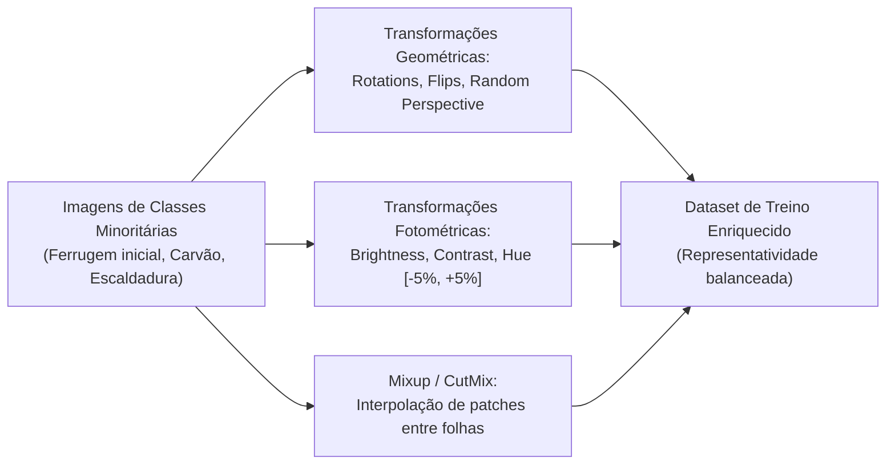

# 📊 Análise de Distribuição e Controle de Desbalanceamento

**Projeto:** Sanidade-Vegetal (SugarVision)  
**Sprint:** 1 — Estratégia de Amostragem  

---

## 1. Distribuição de Classes no Domínio de Diagnóstico

Em tarefas de Visão Computacional para fitopatologia de cana-de-açúcar, a frequência natural de ocorrência de doenças não é uniforme. A tabela abaixo sintetiza a distribuição típica observada nos conjuntos de dados de referência (*Roboflow Universe* e *Mendeley Data*):

| Classe | Nome Científico / Descrição | Frequência Relativa Estimada | Classificação de Densidade |
| :--- | :--- | :---: | :---: |
| **`Saudavel`** | Folhas sem sintomas patológicos (*Healthy*) | ~30% a 35% | Majoritária |
| **`Podridao_Vermelha`** | *Colletotrichum falcatum* (Red Rot) | ~20% a 25% | Majoritária / Média |
| **`Ferrugem`** | *Puccinia melanocephala* (Rust) | ~15% a 20% | Média |
| **`Mosaico`** | *Sugarcane Mosaic Virus* (Mosaic) | ~10% a 15% | Moderada |
| **`Mancha_Amarela`** | *Sugarcane Yellow Leaf Virus* (Yellow Leaf) | ~8% a 12% | Moderada / Minoritária |
| **`Carvao`** | *Sporisorium scitamineum* (Smut) | ~4% a 8% | Minoritária |
| **`Escaldadura`** | *Xanthomonas albilineans* (Leaf Scald) | ~3% a 6% | Minoritária Severa |

---

## 2. Diagnóstico do Índice de Desbalanceamento (*Imbalance Ratio - IR*)

O **Imbalance Ratio (IR)** é definido pela razão entre o número de instâncias da classe majoritária ($N_{\text{max}}$) e da classe minoritária ($N_{\text{min}}$):

$$\text{IR} = \frac{\max_c N_c}{\min_c N_c} \approx \frac{35\%}{3\%} \approx 11.67$$

Um $IR > 10$ indica **desbalanceamento substancial**, exigindo tratamento explícito no pipeline de dados e na função de perda (*Loss Function*), sob pena de a rede neural apresentar alta acurácia global, mas péssimo *Recall* nas patologias críticas minoritárias (como *Carvão* e *Escaldadura*).

---

## 3. Estratégias Algorítmicas de Rebalanceamento

### A. Pesos de Classe na Função de Perda (*Class Weights*)
Para penalizar erros em classes menos frequentes durante o treinamento via *Cross-Entropy Loss*:

$$W_c = \frac{N_{\text{total}}}{C \cdot N_c}$$

Onde $C$ é o número total de classes e $N_c$ é o total de amostras da classe $c$.

### B. Effective Number of Samples (Cui et al., CVPR)
Para evitar superpenalização em datasets com sobreposição visual:

$$W_c^{\text{eff}} = \frac{1 - \beta}{1 - \beta^{N_c}} \quad \text{com } \beta \in [0.99, 0.9999]$$

### C. Focal Loss para Mineração de Exemplos Difíceis (*Hard Examples*)

$$\mathcal{L}_{\text{Focal}} = -\alpha_t (1 - p_t)^\gamma \log(p_t)$$

* Com hiperparâmetros recomendados: $\gamma = 2.0$ e $\alpha_t$ proporcional ao peso da classe.
* Efeito: Reduz o impacto de folhas saudáveis de classificação trivial e foca o gradiente em lesões tênues de ferrugem e manchas em fase inicial.

---

## 4. Estratégia de Augmentation Direcionado

