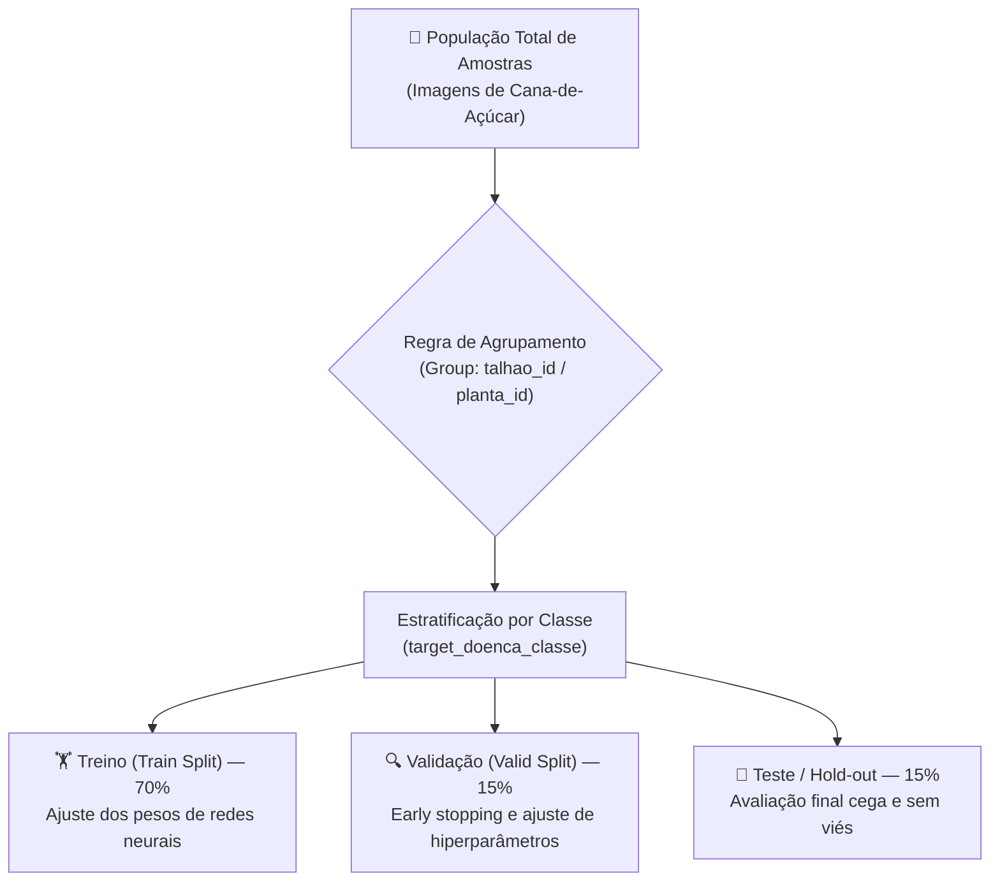

# 🎯 Documento Técnico: Estratégia de Amostragem e Particionamento

**Projeto:** Sanidade-Vegetal (SugarVision)  
**Fase:** Sprint 1 — Engenharia e Governança de Dados  
**Versão:** 1.0.0  

---

## 1. Contexto e Objetivos

O sucesso de modelos de Aprendizado Profundo e Visão Computacional para o diagnóstico fitossanitário da cana-de-açúcar depende criticamente de uma estratégia de amostragem rigorosa. Em cenários agronômicos reais, problemas comuns incluem:

* **Desbalanceamento Severo:** Classes como *Ferrugem* ou *Podridão Vermelha* apresentam surtos pontuais, enquanto imagens de folhas saudáveis ou em início de ciclo podem ser predominantes ou escassas dependendo da época de coleta.
* **Vazamento de Dados (*Data Leakage*):** Múltiplas fotos da mesma folha, planta ou talhão alocadas inadvertidamente em conjuntos de treino e teste geram métricas de acurácia infladas e falhas catastróficas em produção.
* **Confusão Visual Fisiológica:** Folhas saudáveis em senescência natural podem ser confundidas com sintomas iniciais de ferrugem ou deficiência nutricional.

---

## 2. Metodologia de Amostragem Estratificada Agrupada (*Stratified Group Split*)

Para solucionar simultaneamente a preservação da proporção de classes e a independência espacial das amostras, adota-se a **Amostragem Estratificada Agrupada por Talhão/Planta**:



### Regras Fundamentais:
1. **Unidade de Agrupamento (`group_key`):** Todas as imagens pertencentes a uma mesma planta (`planta_id`) e a um mesmo talhão (`talhao_id`) devem residir **exclusivamente** na mesma partição (`train`, `valid` ou `test`).
2. **Estratificação de Rótulos:** O particionador balanceia a distribuição relativa das patologias (`target_doenca_classe`) de modo que a proporção em treino, validação e teste espelhe a distribuição real da população observada.

---

## 3. Particionamento em Desenvolvimento e Validação

A divisão de dados do projeto SugarVision é estruturada em dois níveis:

### A. Divisão Principal (Hold-out Estruturado)
* **Conjunto de Desenvolvimento (Train + Valid - 85%):**
  * **Treino (`train` - 70%):** Utilizado para otimização dos pesos dos modelos (CNNs, Vision Transformers).
  * **Validação (`valid` - 15%):** Utilizado para monitoramento de *loss*, seleção de *checkpoints* e *tuning* de *learning rate*.
* **Conjunto de Teste Cego (`test` - 15%):** Partição isolada, avaliada apenas após o congelamento final da arquitetura do modelo.

### B. Validação Cruzada para Desenvolvimento (`5-Fold StratifiedGroupKFold`)
Para experimentos em notebooks e seleção de arquiteturas (*Backbone Benchmark*), utiliza-se validação cruzada em 5 dobras (*5-folds*), garantindo que cada talhão seja avaliado como conjunto de validação exatamente uma vez.

---

## 4. Partições Temporais (Monitoramento de Safras)

Quando metadados temporais (`data_hora_captura` / safra) estiverem disponíveis, aplica-se o particionamento temporal (*Time-based Out-of-Time Validation*):

```text
Linha do Tempo de Coleta / Safra:
|================ Treino (Meses 1 a 7) ================|=== Validação (Mês 8) ===|=== Teste Futuro (Meses 9-10) ===|
```

* **Vantagem Agronômica:** Avalia a capacidade de generalização do modelo em lidar com variações sazonais de luminosidade, chuvas, poeira e idade do canavial que não existiam no conjunto de treinamento.

---

## 5. Estratégias Específicas: Ferrugem vs. Folhas Saudáveis

### A. Casos de Ferrugem (*Brown Rust* e *Orange Rust*)
* **Desafio:** A ferrugem se manifesta desde pequenas pontuações cloróticas iniciais até pústulas alongadas necróticas com esporulação alaranjada/marrom.
* **Estratégia de Amostragem:**
  1. **Estratificação por Estágio de Severidade:** Garantir amostras de pústulas em fase inicial (onde o diagnóstico precoce tem maior valor econômico) e fase tardia.
  2. **Augmentation Focado em Textura:** Técnicas de *Random Affine*, *Color Jittering* leve e *CutMix* focal para ensinar a rede a focar no padrão de pústulas sem se confundir com terra ou queimaduras de sol.

### B. Casos de Folhas Saudáveis (*Healthy*)
* **Desafio:** Alta variabilidade intrínseca de verde dependendo da adubação de nitrogênio, variedade genética (*cultivar*) e incidência de luz solar direta.
* **Estratégia de Amostragem:**
  1. **Amostragem Multivariedade:** Amostras de folhas saudáveis de pelo menos 3 cultivares distintas (ex.: RB867515, CTC4, SP80-3280).
  2. **Controle de Iluminação:** Inclusão de folhas saudáveis com sombra parcial e reflexo de alta luminosidade para evitar que a rede utilize brilho como atalho (*shortcut learning*) de patologia.

---

## 6. Critérios de Inclusão, Exclusão e Validação

| Critério | Regra de Aceite | Ação em Caso de Violação |
| :--- | :--- | :--- |
| **Nitidez / Foco** | Variância do Laplaciano $> 100$ | Exclusão de imagens borradas ilegíveis |
| **Área Foliar Visível** | Folha ocupa $\ge 40\%$ do enquadramento | Recorte (*crop*) ou descarte |
| **Resolução Mínima** | Dimensão $\ge 512 \times 512$ pixels | Rejeição ou interpolação com aviso |
| **Confiabilidade da Anotação** | Concordância de especialista $\ge 90\%$ | Manter amostra com peso ponderado na Loss |
| **Integridade de Grupo** | Mesma planta em 1 única partição | Reexecução da rotina `sampling_pipeline.py` |
