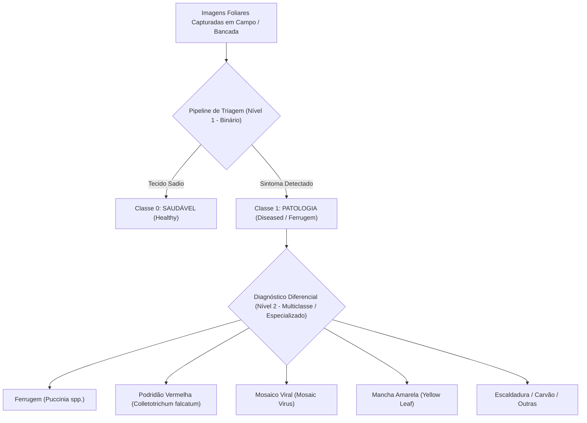
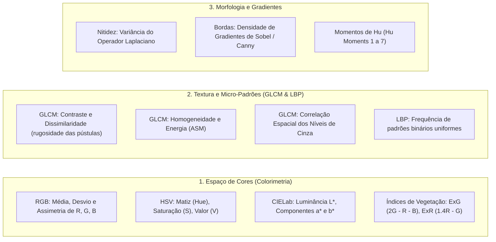

# 🌿 Definição do Escopo do Problema de Sanidade Vegetal

**Projeto:** Sanidade-Vegetal (SugarVision)  
**Sprint:** 1 — Setup, Sample & Explore (Framework SEMMA)  
**Responsável:** Cesar (Domínio, Escopo e Visão Computacional)  
**Data:** 02 de Setembro de 2026  

---

## 1. Formulação do Problema e Abordagem de Modelagem

### 1.1 Contexto de Negócio e Agronômico
A **sanidade vegetal** e o monitoramento precoce de patologias foliares representam um dos pilares mais críticos da agricultura de precisão e da sustentabilidade no campo. A ocorrência de **Ferrugem** (*Puccinia melanocephala* / *Puccinia kuehnii* / *Phakopsora pachyrhizi*) acarreta a destruição precoce da área fotossinteticamente ativa das folhas, levando a perdas severas de produtividade de biomassa e rendimento agrícola que podem ultrapassar **30% a 70%** se não controladas nos estágios iniciais de infecção.

Atualmente, o monitoramento tradicional é realizado por meio de inspeção visual humana no campo — um processo:
- **Subjetivo** (dependente do nível de treinamento do inspetor);
- **Lento e de baixa cobertura espacial** (amostragem manual pontual em talhões extensos);
- **Custoso e propenso a fadiga** operacional.

### 1.2 Decisão Arquitetural: Binário vs. Multiclasse

Para assegurar uma esteira de entrega ágil, reprodutível e orientada a resultados rápidos com modelos clássicos de Machine Learning (como **Support Vector Machines - SVM**), a arquitetura do problema foi dividida em dois níveis de granularidade:

#### A. Nível 1 (Baseline Prioritário da Sprint 1 / SVM Inicial): Classificação Binária
* **Target:** $y \in \{0, 1\}$
  * $y = 0$: **Saudável (Healthy)** — Tecido foliar túrgido, sem pústulas ou necrose.
  * $y = 1$: **Ferrugem (Rust / Diseased)** — Tecido com lesões pontuais, pústulas castanho-alaranjadas e halo clorótico.
* **Justificativa:** Permite estabelecer uma linha de base (*baseline*) robusta com hiperplanos de separação linear e RBF via SVM, avaliando a capacidade discriminativa das features visuais (cor HSV, textura GLCM e morfologia) com alta interpretabilidade.

#### B. Nível 2 (Extensão / Multiclasse Especializada):
* **Target:** $y \in \{0, 1, 2, 3, 4, 5, 6\}$ contemplando as 7 classes catalogadas nas bases oficiais (*Roboflow* e *Mendeley Data*).

---

## 2. Delimitação e Taxonomia das Classes Fitopatológicas

| Código da Classe | Nome da Classe | Agente Causal / Etiologia | Assinatura Visual Característica |
| :---: | :--- | :--- | :--- |
| `0` | **HEALTHY (Saudável)** | Ausência de patógeno | Superfície foliar homogênea, verde uniforme (dominância no canal G e baixa variância de textura). |
| `1` | **RUST (Ferrugem)** | Fungo *Puccinia spp.* | Pequenas pústulas alongadas ou pontuais em relevo, coloração castanho-avermelhada/ferruginosa, com halos amarelados. |
| `2` | **RED ROT (Podridão Vermelha)** | Fungo *Colletotrichum falcatum* | Manchas alongadas com centro avermelhado escuro, descoloração da nervura central e lesões coalescentes. |
| `3` | **MOSAIC (Mosaico)** | *Sugarcane Mosaic Virus (SCMV)* | Padrão mosqueado com alternância de áreas verdes normais e faixas verde-claras/amareladas longitudinais. |
| `4` | **YELLOW LEAF (Mancha Amarela)** | *Sugarcane Yellow Leaf Virus (SCYLV)* | Amarelecimento progressivo e intenso da nervura central no dorso da folha, estendendo-se para o limbo. |
| `5` | **LEAF SCALD (Escaldadura)** | Bactéria *Xanthomonas albilineans* | Listras esbranquiçadas bem delimitadas ao longo das nervuras ("traços de lápis") com necrose apical. |
| `6` | **GRASSY SHOOT (Broto Enfezado / Carvão)** | Fitoplasma / *Sporisorium scitamineum* | Proliferação anormal de perfilhos delgados e clorose generalizada. |

### 2.1 Escala Diagramática e Estimativa de Severidade
Na fase de análise exploratória, o grau de acometimento foliar é estimado pela **Área Foliar Afetada (AFA - %)**:
- **Grau 0 (Nulo):** $0\%$ (Saudável)
- **Grau 1 (Leve / Inicial):** $< 5\%$ de área com pústulas isoladas
- **Grau 2 (Moderado):** $5\% \le \text{AFA} \le 20\%$ (pústulas em expansão)
- **Grau 3 (Severo):** $> 20\%$ (coalescência de lesões, dessecação foliar e necrose generalizada)

---

## 3. Mapeamento das Variáveis de Interesse (Feature Space)

Para que a tabela analítica (**ABT**) alimente os algoritmos de aprendizado supervisionado (SVM com kernels Linear e RBF), mapeamos três blocos principais de variáveis descritoras:

### Detalhamento das Variáveis de Extração:
1. **Razões de Cor e Índices Fotométricos:**
   - **ExG (*Excess Green Index*):** $2 \cdot G - R - B$ — Alto em folhas saudáveis, deprime severamente na ferrugem.
   - **ExR (*Excess Red Index*):** $1.4 \cdot R - G$ — Realça as pústulas avermelhadas/alaranjadas da ferrugem.
   - **Razão $R / (R + G + B)$:** Diferencia lesões necróticas do limbo verde sadio.
2. **Atributos de Textura de Haralick (GLCM - $\theta \in \{0^\circ, 45^\circ, 90^\circ, 135^\circ\}$):**
   - **Contraste ($\sum |i-j|^2 P_{i,j}$):** Captura a quebra abrupta entre a epiderme sadia e a crosta áspera da pústula de ferrugem.
   - **Homogeneidade ($\sum \frac{P_{i,j}}{1 + |i-j|}$):** Alto em folhas saudáveis e baixo em folhas doentes.
3. **Indicadores de Qualidade e Captura:**
   - Resolução ($W \times H$), tamanho do arquivo (KB), nível de compressão JPEG e índice de nitidez (Laplacian Variance).

---

## 4. Registro Formal de Decisões Técnicas da Sprint 1

1. **Decisão 1 — Foco no Diagnóstico Diferencial de Ferrugem:**
   - *Status:* Aprovado pela equipe.
   - *Racional:* A ferrugem é a doença de maior volatilidade e risco fitossanitário no escopo avaliado, possuindo marcadores visuais nítidos de textura e cor avermelhada.
2. **Decisão 2 — Priorização de Features Clássicas para Modelo SVM:**
   - *Status:* Aprovado.
   - *Racional:* Extrair features estatísticas de cor e textura para compor a ABT permite treinar e auditar modelos SVM leves, interpretáveis e com baixo custo computacional na Sprint 1/2 antes de explorar redes convolucionais profundas (*Deep Learning*).
3. **Decisão 3 — Prevenção de Leakage Amostral:**
   - *Status:* Aprovado.
   - *Racional:* As partições de validação e teste serão congeladas e isoladas durante a extração de métricas globais e padronizações.
