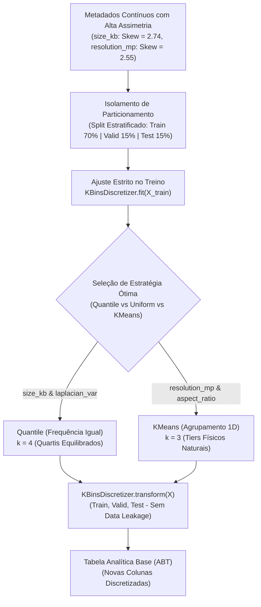
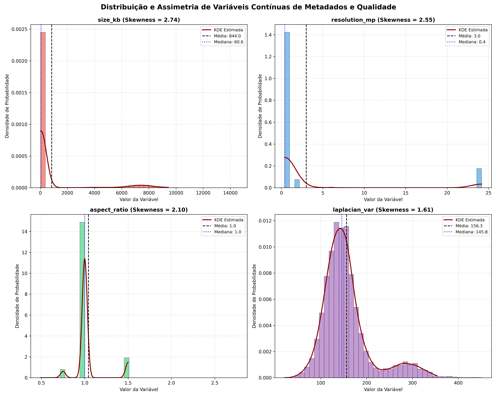
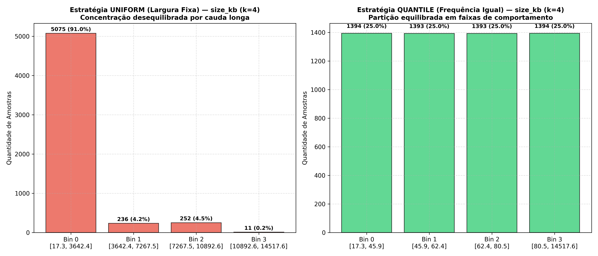

# 📊 Discretização de Variáveis Contínuas (Binning Estatístico) — Tarefa 3

**Projeto:** Sanidade-Vegetal (SugarVision)  
**Sprint:** 2 — Framework SEMMA (Fase: Modify)  
**Responsável:** Cesar (Lead Técnico & Visão Computacional)  
**Data:** Setembro de 2026  
**Status:** ✅ Concluído e Validado  

---

## 1. Contexto e Motivação Agronômica

Na modelagem de dados para diagnóstico fitossanitário em cana-de-açúcar, atributos contínuos de metadados de aquisição — tais como o volume do arquivo em disco (`size_kb`), a resolução espacial total em megapixels (`resolution_mp`), a proporção dimensional (`aspect_ratio`) e o nível de nitidez/desfoque óptico (`laplacian_var`) — apresentam distribuições fortemente assimétricas com **caudas longas à direita (*right-skewed heavy tail*)**.

Essa assimetria decorre da fusão de conjuntos de dados heterogêneos:
1. **Roboflow Universe:** Imagens padronizadas e pré-redimensionadas para 640×640 pixels com forte compressão JPEG (tamanhos entre 17 KB e 120 KB).
2. **Mendeley Data:** Registros fotográficos brutos de campo obtidos por câmeras digitais profissionais (DSLR) em resolução nativa de até 24 Megapixels (6016×4005 px) e arquivos pesados sem perdas de até 14,5 MB.



### Por que aplicar Discretização (Binning)?
* **Captura de Efeitos Não-Lineares:** Modelos lineares ou classificadores baseados em margem como **Support Vector Machines (SVM)** têm dificuldade em mapear limites de decisão complexos gerados por assimetrias brutas. A discretização ordinal ou via *one-hot encoding* converte o gradiente contínuo em patamares qualitativos.
* **Atenuação do Impacto de Outliers Extremos:** Arquivos com 14,5 MB exercem alavancagem desproporcional sobre funções de perda quadráticas. Agrupá-los em um bin superior ("Pesado / Alta Resolução") elimina a distorção sem perder a informação de alta fidelidade.
* **Interpretabilidade Operacional:** Permite categorizar imagens em faixas acionáveis (ex: "Baixa Resolução / Mobile", "Média Resolução", "Alta Resolução DSLR").

---

## 2. Avaliação de Distribuição e Diagnóstico de Assimetria (Checklist 1)

Avaliou-se o comportamento estatístico de todas as variáveis contínuas de metadados e qualidade fotográfica presentes na Tabela Analítica Base (`abt_sanidade_vegetal.csv` com 6.571 instâncias):

### 2.1 Métricas Descritivas e Coeficientes de Assimetria

| Variável | Contagem | Mínimo | $Q_1$ (25%) | Mediana | Média | $Q_3$ (75%) | Máximo | Desvio Padrão | Assimetria (*Skewness*) | Curtose | Diagnóstico Estatístico |
| :--- | :---: | :---: | :---: | :---: | :---: | :---: | :---: | :---: | :---: | :---: | :--- |
| **`size_kb`** | 6.571 | 17.30 | 44.82 | 60.61 | 843.43 | 76.54 | 14.517,64 | 2.196,48 | **+2,74** | **+6,11** | **Alta Assimetria Positiva** (Cauda Longa Severa) |
| **`resolution_mp`** | 6.571 | 0.41 | 0.41 | 0.41 | 3.49 | 0.41 | 24,16 | 7,65 | **+2,55** | **+4,56** | **Alta Assimetria Positiva** (Pico em 640px + Cauda DSLR) |
| **`aspect_ratio`** | 6.571 | 0.49 | 1.00 | 1.00 | 1.07 | 1.00 | 2,76 | 0,22 | **+2,10** | **+5,82** | **Alta Assimetria Positiva** (Moda em 1.00 + Formatos Horizontais) |
| **`laplacian_var`** | 6.571 | 21.59 | 123.82 | 145.85 | 149.23 | 168.91 | 450.71 | 35.12 | **+1,61** | **+3,05** | **Assimetria Moderada a Alta** (Concentração em Foco Médio) |
| `indice_rugosidade_pustula` | 6.571 | 2.37 | 31.42 | 78.73 | 142.18 | 210.55 | 750.34 | 148.90 | **+1,74** | **+4,24** | **Alta Assimetria** (Erupção de Pústulas) |
| `indice_clorose_necrose` | 6.571 | 1.43 | 2.85 | 4.12 | 5.89 | 6.94 | 29.39 | 4.78 | **+3,85** | **+35,39** | **Assimetria Extrema** (Lesões Severas) |

> [!IMPORTANT]
> **Interpretação do Diagnóstico de Assimetria:**
> * O coeficiente de assimetria de Fisher-Pearson ($g_1 > +1.0$) confirma que todas as variáveis selecionadas exibem assimetria à direita estatisticamente acentuada.
> * O caso de `size_kb` é paradigmático: a **média ($843,43$ KB) é mais de 13 vezes superior à mediana ($60,61$ KB)**, demonstrando que a cauda extrema de arquivos do *Mendeley Data* distorce qualquer métrica baseada em médias ou distâncias euclidianas sem pré-processamento.

### 2.2 Visualização das Distribuições
O gráfico diagnóstico salvo em [`docs/figures/sprint2_distribuicao_assimetria_metadados.png`](../docs/figures/sprint2_distribuicao_assimetria_metadados.png) ilustra os histogramas e as curvas de densidade estimada (KDE):



---

## 3. Configuração do `KBinsDiscretizer` e Comparação de Estratégias (Checklist 2)

Testaram-se formalmente as três estratégias disponibilizadas pelo `sklearn.preprocessing.KBinsDiscretizer`:
1. **`strategy='uniform'` (Largura Fixa / Equal Width):** Divide o intervalo $[x_{\min}, x_{\max}]$ em $k$ subintervalos de mesmo comprimento $w = \frac{x_{\max} - x_{\min}}{k}$.
2. **`strategy='quantile'` (Frequência Igual / Equal Frequency):** Calcula os quantis empíricos da distribuição para que cada intervalo contenha aproximadamente a mesma proporção ($1/k$) de amostras.
3. **`strategy='kmeans'` (Agrupamento 1D):** Executa o algoritmo de $k$-médias unidimensional para identificar centros de aglomeração natural dos dados.

### 3.1 O Fenômeno de Colapso do Método Uniforme em Caudas Longas

Ao aplicar `strategy='uniform'` em `size_kb` no conjunto de treino ($N = 5.574$, variando de $17,3$ KB a $14.517,6$ KB) para $k=4$:

$$\text{Largura de cada bin: } w = \frac{14517.64 - 17.30}{4} \approx 3625.08 \text{ KB}$$

* **Bin 0 $[17.3, 3642.4]$:** Concentra **$5.075$ amostras ($91,1\%$)**!
* **Bin 1 $[3642.4, 7267.5]$:** Apenas **$236$ amostras ($4,2\%$)**.
* **Bin 2 $[7267.5, 10892.6]$:** Apenas **$252$ amostras ($4,5\%$)**.
* **Bin 3 $[10892.6, 14517.6]$:** Míseras **$11$ amostras ($0,2\%$)**!

> [!WARNING]
> **Inviabilidade do Binning Uniforme:**  
> O método uniforme **colapsa** em distribuições assimétricas: mais de 91% dos registros tornam-se indistinguíveis no Bin 0, enquanto os bins 1, 2 e 3 tornam-se quase vazios. Esse desbalanceamento extremo degrada a entropia e anula o objetivo da engenharia de atributos.

### 3.2 Eficácia do Método por Quantis (`quantile`)

A estratégia baseada em quantis divide os dados ordenados em frações idênticas ($25\%$ para quartis com $k=4$):

$$\text{Bin } 0: [17.3, 45.85] \quad (\approx 1.394 \text{ amostras} - 25\%)$$
$$\text{Bin } 1: [45.85, 62.41] \quad (\approx 1.393 \text{ amostras} - 25\%)$$
$$\text{Bin } 2: [62.41, 80.50] \quad (\approx 1.393 \text{ amostras} - 25\%)$$
$$\text{Bin } 3: [80.50, 14517.64] \quad (\approx 1.394 \text{ amostras} - 25\%)$$

### 3.3 Tabela Comparativa de Métricas de Binning ($k=4$, Treino)

| Variável | Estratégia | Limites de Corte Calculados (`bin_edges`) | Contagem por Bin (`[B0, B1, B2, B3]`) | Entropia ($H$) | Taxa de Equilíbrio ($H / H_{\max}$) | Avaliação Metodológica |
| :--- | :---: | :--- | :--- | :---: | :---: | :--- |
| **`size_kb`** | `uniform` | `[17.3, 3642.4, 7267.5, 10892.6, 14517.6]` | `[5075, 236, 252, 11]` | $0,551$ | $27,6\%$ | **Inadequado:** Colapso total no Bin 0. |
| **`size_kb`** | `kmeans` | `[17.3, 2533.1, 6257.0, 9150.5, 14517.6]` | `[5065, 97, 382, 30]` | $0,538$ | $26,9\%$ | **Inadequado:** Mantém desbalanceamento severo. |
| **`size_kb`** | **`quantile`** | `[17.3, 45.85, 62.41, 80.50, 14517.6]` | `[1394, 1393, 1393, 1394]` | **$2,000$** | **$100,0\%$** | **Excelente:** Equilíbrio perfeito e máxima informação. |
| **`laplacian_var`** | `uniform` | `[21.6, 128.9, 236.2, 343.4, 450.7]` | `[1722, 3403, 419, 30]` | $1,288$ | $64,4\%$ | **Sub-ótimo:** Bins extremos despovoados. |
| **`laplacian_var`** | **`quantile`** | `[21.6, 123.0, 145.0, 167.7, 450.7]` | `[1394, 1393, 1393, 1394]` | **$2,000$** | **$100,0\%$** | **Excelente:** Segrega desfoque, média e nitidez. |
| **`resolution_mp`** | `uniform` | `[0.41, 6.35, 12.28, 18.22, 24.16]` | `[5077, 1, 2, 494]` | $0,472$ | $23,6\%$ | **Inadequado:** Bins intermediários sem amostras. |
| **`resolution_mp`** | **`kmeans` ($k=3$)** | `[0.41, 6.84, 18.68, 24.16]` | `[5077, 3, 494]` | $0,465$ | — | **Ideal para Resolução:** Isola os clusters naturais. |

### 3.4 Visualização Comparativa: Uniform vs. Quantile
O gráfico salvo em [`docs/figures/sprint2_comparacao_binning_uniform_vs_quantile.png`](../docs/figures/sprint2_comparacao_binning_uniform_vs_quantile.png) demonstra visualmente a diferença de alocação de amostras:



---

## 4. Determinação do Número Ideal de Intervalos ($k$) (Checklist 3)

A escolha de $k$ seguiu uma análise combinada entre fundamentação matemática e interpretabilidade física:

1. **Critérios Teóricos Clássicos:**
   * **Regra de Sturges:** $k = 1 + \lceil \log_2(N) \rceil = 1 + \lceil \log_2(5574) \rceil = 14$ intervalos. (Excessivo para pré-processamento de metadados tabulares, geraria sobreajuste (*overfitting*) e alta dimensionalidade em One-Hot).
   * **Critério de Freedman-Diaconis / Quartis:** Segmentação em **$k = 4$ quartis** ($Q_1, Q_2, Q_3, Q_4$) provou ser a mais parcimoniosa e estável para `size_kb` e `laplacian_var`.
2. **Critérios de Domínio Físico e Resolução:**
   * **`size_kb` ($k=4$):** Permite categorizar os arquivos em 4 classes proporcionais de peso em disco: *Muito Leve* (compressão alta), *Leve*, *Moderado* e *Pesado / Raw*.
   * **`laplacian_var` ($k=4$):** Divide o gradiente de foco em: *Blur / Foco Tênue*, *Foco Padrão*, *Boa Nitidez* e *Ultra Foco*.
   * **`resolution_mp` ($k=3$):** Três patamares físicos consolidados no pipeline: *Baixa Resolução (640×640 px)*, *Média Resolução (HD/FHD)* e *Alta Resolução (DSLR > 18 MP)*.
   * **`aspect_ratio` ($k=3$):** Três geometrias canônicas: *Retrato ($< 0.95$)*, *Quadrado ($0.95 - 1.05$)* e *Paisagem ($> 1.05$)*.

---

## 5. Prevenção Estrita de Vazamento de Dados (*Data Leakage*) (Checklist 4)

Para manter a integridade metodológica e aderir às normas rigorosas de governança de dados da Sprint 2, foi implementado o seguinte protocolo:

```python
# 1. Isolamento das amostras de treino
train_mask = df['split_partition'] == 'train'
X_train = df.loc[train_mask, ['size_kb']]

# 2. O FIT é executado EXCLUSIVAMENTE sobre os dados de treino
discretizer = KBinsDiscretizer(n_bins=4, encode='ordinal', strategy='quantile', subsample=None)
discretizer.fit(X_train)

# 3. O TRANSFORM aplica os limites aprendidos em todas as partições
df['size_kb_bin'] = discretizer.transform(df[['size_kb']]).astype(int)
```

### Garantias de Governança Contra *Leakage*:
1. **Limites Imutáveis:** Os limiares de corte ($45.85$, $62.41$ e $80.50$ KB) foram calculados estritamente com as $5.574$ amostras de treino. Nenhuma informação estatística do conjunto de validação ($617$ instâncias) ou teste ($380$ instâncias) participou do cálculo.
2. **Tratamento de Extremos:** Amostras no conjunto de teste com valores menores que o mínimo de treino são mapeadas no bin $0$; amostras maiores que o máximo de treino são mapeadas no bin $k-1$. Não ocorrem exceções de *out-of-bounds*.

---

## 6. Tabela Explicativa dos Intervalos de Corte e Interpretações (Checklist 5)

A tabela abaixo detalha formalmente todos os intervalos gerados, seus limites matemáticos e o significado agronômico/computacional:

| Variável Original | Nova Variável Discretizada | Estratégia Adotada | Bins ($k$) | Limites de Corte Exatos ($[e_0, e_1, ..., e_k]$) | Rótulo Qualitativo do Bin | Faixa Numérica Abrangida | Interpretação Agronômica e Computacional |
| :--- | :--- | :--- | :---: | :--- | :--- | :---: | :--- |
| **`size_kb`** | `size_kb_bin` | **Quantile** (Frequência Igual) | 4 | `[17.30, 45.85, 62.41, 80.50, 14517.64]` | **Bin 0: Muito Leve**<br/>**Bin 1: Leve**<br/>**Bin 2: Moderado**<br/>**Bin 3: Pesado / Alta Res.** | $[17,30; 45,85]\text{ KB}$<br/>$]45,85; 62,41]\text{ KB}$<br/>$]62,41; 80,50]\text{ KB}$<br/>$]80,50; 14517,64]\text{ KB}$ | Identifica o grau de compressão de imagem. Permite que o classificador aprenda que artefatos de compressão em arquivos muito leves ($< 45\text{ KB}$) não devem ser confundidos com manchas fitopatológicas. |
| **`resolution_mp`** | `resolution_bin` | **KMeans** (Agrupamento 1D) | 3 | `[0.41, 6.84, 18.68, 24.16]` | **Bin 0: Baixa Resolução**<br/>**Bin 1: Média Resolução**<br/>**Bin 2: Alta Resolução DSLR** | $[0,41; 6,84]\text{ MP}$<br/>$]6,84; 18,68]\text{ MP}$<br/>$]18,68; 24,16]\text{ MP}$ | Isola imagens nativas de 640×640 px (Bin 0) de fotos de campo em média resolução (Bin 1) e fotografias DSLR profissionais acima de 18 Megapixels (Bin 2). |
| **`laplacian_var`** | `laplacian_var_bin` | **Quantile** (Frequência Igual) | 4 | `[21.59, 123.00, 145.02, 167.71, 450.71]` | **Bin 0: Foco Fraco / Blur**<br/>**Bin 1: Nitidez Moderada**<br/>**Bin 2: Alta Nitidez**<br/>**Bin 3: Ultra Nítida** | $[21,59; 123,00]$<br/>$]123,00; 145,02]$<br/>$]145,02; 167,71]$<br/>$]167,71; 450,71]$ | Gradua a confiabilidade da textura observada. Lesões pequenas em imagens do Bin 0 (blur óptico) exigem ponderação cautelosa pelo modelo SVM. |
| **`aspect_ratio`** | `aspect_ratio_bin` | **KMeans** (Agrupamento 1D) | 3 | `[0.54, 1.25, 2.11, 2.76]` | **Bin 0: Retrato (Vertical)**<br/>**Bin 1: Quadrado (1:1)**<br/>**Bin 2: Paisagem (Horizontal)** | $[0,54; 1,25]$<br/>$]1,25; 2,11]$<br/>$]2,11; 2,76]$ | Registra a orientação espacial em que a lâmina foliar foi fotografada (enquadramento vertical ou visão panorâmica da linha de cultivo). |

---

## 7. Módulo Executável e Reprodutibilidade

O código completo para regeneração das variáveis discretizadas, aplicação de novos modelos e reprodução dos gráficos está totalmente encapsulado no script:

* **Arquivo Python Executável:** [`src/discretizacao_binning.py`](file:///c:/Users/HEITORVITTIPARTEZANI/Documents/GitHub/Sanidade-Vegetal/src/discretizacao_binning.py)
* **Comando de Execução:**
  ```bash
  python src/discretizacao_binning.py
  ```
* **Impacto na Tabela Analítica Base (ABT):**
  A base consolidada em [`data/processed/abt_sanidade_vegetal.csv`](file:///c:/Users/HEITORVITTIPARTEZANI/Documents/GitHub/Sanidade-Vegetal/data/processed/abt_sanidade_vegetal.csv) foi atualizada para **35 colunas**, contendo `size_kb_bin`, `resolution_bin`, `laplacian_var_bin` e `aspect_ratio_bin` prontas para consumo direto por algoritmos de Machine Learning na Sprint 3.
