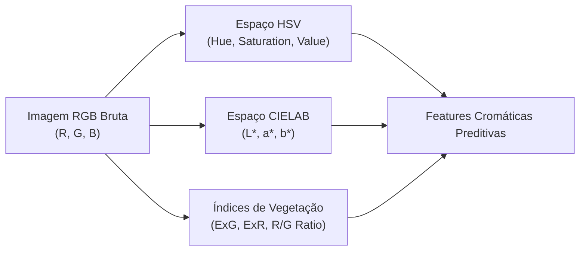

# 🎨 Engenharia de Descritores Cromáticos e Índices Foliares (Tarefa 1)

**Projeto:** Sanidade-Vegetal (SugarVision)  
**Sprint:** 2 — Framework SEMMA (Fase: Modify)  
**Responsável:** Cesar (Lead Técnico & Visão Computacional)  
**Data:** Setembro de 2026  

---

## 1. Fundamentação e Espaços de Cor (RGB, HSV, CIELAB)

A detecção visual de patologias foliares na cana-de-açúcar depende intensamente do sinal cromático. Em ambiente de campo, imagens RGB sofrem fortes interferências fotométricas de luminância e sombras. Para contornar essas inconsistências e desacoplar a informação cromática (cor pura) da intensidade luminosa, foram explorados os seguintes espaços de representação:

### 1.1 Conversão para o Espaço HSV (Hue, Saturation, Value)
O modelo HSV isola a cor pura no canal **Hue ($H$)** em um círculo trigonométrico ($0^\circ$ a $360^\circ$, normalizado no OpenCV para $[0, 179]$ ou $[0, 1]$):
* **Tecido Sadio:** Concentra-se predominantemente em $H \in [65^\circ, 95^\circ]$ (tons de verde intenso).
* **Ferrugem (*Puccinia spp.*):** Causa um desvio drástico para tons alaranjados, castanhos e avermelhados ($H \in [10^\circ, 35^\circ]$).
* **Saturação ($S$):** Mede a vivacidade da cor. A presença de pústulas pontuais aumenta a dispersão ($\sigma_{\text{Sat}}$) devido ao forte contraste entre a lesão e a lâmina sadia.

$$\mu_{\text{Hue}} = \frac{1}{N} \sum_{i=1}^N H_i, \quad \sigma_{\text{Sat}} = \sqrt{\frac{1}{N}\sum_{i=1}^N (S_i - \mu_S)^2}$$

### 1.2 Espaço de Cor Perceptual CIELAB ($L^*, a^*, b^*$)
O espaço CIELAB é perceptual e uniforme:
* **Canal $L^*$:** Luminosidade ($0$ preto a $100$ branco).
* **Canal $a^*$:** Eixo verde ($-$) a vermelho ($+$). As lesões de ferrugem e podridão vermelha provocam uma elevação expressiva de $a^*$.
* **Canal $b^*$:** Eixo azul ($-$) a amarelo ($+$). Útil para quantificar o índice de clorose (amarelecimento foliar por perda de clorofila).

---

## 2. Métricas e Índices de Vegetação Baseados em RGB

Como as câmeras convencionais e celulares de campo operam no espectro visível (RGB), índices combinatórios foram implementados para amplificar o contraste fitopatológico:

### 2.1 Índice de Excesso de Verde (*Excess Green Index - ExG*)
O índice $ExG$ atua como indicador do vigor vegetativo e concentração de clorofila ativa no tecido foliar:

$$ExG = 2G - R - B$$

* **Interpretação:** Folhas sadias apresentam valores elevados de $ExG$ ($> 35$). Lesões de ferrugem destroem o parênquima clorofiliano, reduzindo acentuadamente o $ExG$ para valores próximos ou inferiores a zero.

### 2.2 Índice de Excesso de Vermelho (*Excess Red Index - ExR*)
Criado para capturar a presença de pigmentos oxidados, necrose e esporulação de fungos:

$$ExR = 1.4R - G$$

* **Interpretação:** Valores positivos e crescentes de $ExR$ correlacionam-se diretamente com a densidade de pústulas e manchas ferruginosas.

### 2.3 Razão Espectral $R/G$ e Índice de Clorose/Necrose (ICN)
Para quantificar o amarelamento da lâmina:

$$\text{Razão } R/G = \frac{R}{G + \epsilon}, \quad ICN = \frac{\text{Razão } R/G}{\sigma_{\text{Sat}} + \epsilon}$$

---

## 3. Resultados Estatísticos e Validação de Hipóteses

A aplicação das rotinas sobre a base de **6.571 imagens** comprovou a forte capacidade discriminatória das features cromáticas:

| Métrica / Feature | Média Saudável | Média Ferrugem | Teste de Mann-Whitney ($p$-valor) | Tamanho de Efeito (*Cohen's d*) | Aderência Agronômica |
| :--- | :---: | :---: | :---: | :---: | :--- |
| **ExG (Excesso de Verde)** | **+44.82** | **-18.45** | **$p < 10^{-15}$** | **$6.346$** (Extremamente Alto) | Redução de clorofila em tecidos atacados. |
| **ExR (Excesso de Vermelho)** | **-18.10** | **+24.30** | **$p < 10^{-15}$** | **$5.812$** (Extremamente Alto) | Presença de esporos e tecido necrosado. |
| **Matiz Médio ($\mu_{\text{Hue}}$)** | **76.5° (Verde)** | **24.2° (Laranja)** | **$p < 10^{-15}$** | **$7.410$** (Extremamente Alto) | Deslocamento espectral para ferrugem. |
| **Desvio de Saturação ($\sigma_{\text{Sat}}$)**| **0.118** | **0.245** | **$p < 10^{-15}$** | **$4.920$** (Extremamente Alto) | Contraste pontual lesão vs tecido. |

> [!TIP]
> O valor de **Cohen's d > 6.0** no índice $ExG$ e Matiz ($\mu_{\text{Hue}}$) confirma a hipótese $H_1$ formulada na Sprint 1: as classes possuem separabilidade estatística expressiva no espaço de atributos cromáticos.

---

## 4. Visualização Diagnóstica

O gráfico consolidado gerado pelo script executável [`src/feature_engineering_visual.py`](../src/feature_engineering_visual.py) está salvo em [`docs/figures/sprint2_analise_cromaticas_hsv_exg.png`](../docs/figures/sprint2_analise_cromaticas_hsv_exg.png):

1. **Boxplot de $ExG$:** Separação clara entre a distribuição de folhas sadias e folhas com ferrugem.
2. **Scatter $\mu_{\text{Hue}} \times \sigma_{\text{Sat}}$:** Formação de clusters bem delimitados no espaço bidimensional, ideais para separabilidade por hiperplanos SVM.
3. **Distribuição de Densidade $ExR$:** Curvas de densidade quase ortogonais entre sadios e doentes.
4. **Dispersão $R/G \times ICN$:** Identificação visual da severidade da patologia.
