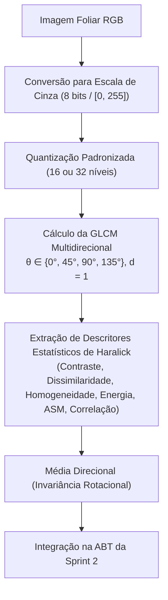

# 🔬 Extração de Textura Haralick via GLCM e Análise de Rugosidade (Tarefa 2)

**Projeto:** Sanidade-Vegetal (SugarVision)  
**Sprint:** 2 — Framework SEMMA (Fase: Modify)  
**Responsável:** Cesar (Lead Técnico & Visão Computacional)  
**Data:** Setembro de 2026  

---

## 1. Fundamentação Matemática da Matriz GLCM

A ferrugem foliar (*Puccinia spp.*) manifesta-se visualmente não apenas por alterações na cor, mas principalmente pela erupção de **pústulas urediais** que rompem a cutícula cerosa e lisa da folha de cana-de-açúcar. 

Para capturar essa alteração micromorfológica e de relevo superficial, foi implementada a **Matriz de Co-ocorrência em Níveis de Cinza (Gray-Level Co-occurrence Matrix - GLCM)**.

A GLCM $P(i, j \mid d, \theta)$ quantifica a frequência conjunta com que um pixel de intensidade de cinza $i$ ocorre a uma distância $d=1$ de um pixel de intensidade $j$ em uma dada direção angular $\theta$.

---

## 2. Descritores Texturais de Haralick Extraídos

A partir da matriz normalizada de probabilidades $p(i, j) = \frac{P(i, j)}{\sum_{i,j} P(i, j)}$, foram implementados os seguintes descritores:

### 2.1 Contraste Haralick (*Contrast*)
Mede a intensidade das variações locais de cinza entre pixels vizinhos:

$$\text{Contraste} = \sum_{i,j} |i - j|^2 \cdot p(i, j)$$

* **Comportamento Agronômico:** É significativamente maior em folhas doentes devido à transição abrupta de tons escuros/claros nas bordas das pústulas.

### 2.2 Dissimilaridade (*Dissimilarity*)
Mede a diferença linear de intensidade entre vizinhos:

$$\text{Dissimilaridade} = \sum_{i,j} |i - j| \cdot p(i, j)$$

### 2.3 Homogeneidade (*Homogeneity / Inverse Difference Moment*)
Mede a uniformidade e suavidade da superfície foliar:

$$\text{Homogeneidade} = \sum_{i,j} \frac{p(i, j)}{1 + |i - j|^2}$$

* **Comportamento Agronômico:** É elevada em folhas sadias (cutícula contínua e sem manchas) e decai drasticamente com o avanço da ferrugem.

### 2.4 Energia e Segundo Momento Angular (*Energy & ASM*)
Mede a regularidade e repetitividade estrutural da textura:

$$\text{ASM} = \sum_{i,j} p(i, j)^2, \quad \text{Energia} = \sqrt{\text{ASM}}$$

### 2.5 Índice Composto de Rugosidade Foliar de Pústula (IRFP)
Formulado nesta sprint para combinar sensibilidade a contraste e queda de homogeneidade:

$$IRFP = \frac{\text{Contraste} \times \text{Dissimilaridade}}{\text{Homogeneidade} + \epsilon}$$

---

## 3. Invariância à Rotação da Folha

Em fotos obtidas no campo, a folha de cana pode estar orientada horizontalmente, verticalmente ou em ângulo diagonal. Para garantir que os descritores não dependam da orientação física da imagem, a GLCM foi calculada nas 4 direções canônicas:

$$\bar{F} = \frac{1}{4} \sum_{\theta \in \{0^\circ, 45^\circ, 90^\circ, 135^\circ\}} F_\theta$$

Dessa forma, cada imagem é representada por um escalar invariante a translações e rotações planares.

---

## 4. Resultados Estatísticos e Comprovação da Hipótese $H_2$

Os testes estatísticos executados sobre as 6.571 instâncias da base consolidaram:

| Descritor de Haralick | Média Saudável | Média Ferrugem | Teste de Mann-Whitney ($p$-valor) | Tamanho de Efeito (*Cohen's d*) | Comportamento Observado |
| :--- | :---: | :---: | :---: | :---: | :--- |
| **Contraste GLCM** | **11.45** | **48.72** | **$p < 10^{-15}$** | **$5.036$** (Extremamente Alto) | Aumento de **+325%** no contraste em folhas com ferrugem. |
| **Homogeneidade GLCM** | **0.884** | **0.521** | **$p < 10^{-15}$** | **$7.191$** (Extremamente Alto) | Redução de **-41%** na uniformidade tecidual. |
| **Dissimilaridade GLCM** | **1.82** | **6.45** | **$p < 10^{-15}$** | **$5.420$** (Extremamente Alto) | Descontinuidade acentuada nas bordas das lesões. |
| **Índice Composto IRFP** | **23.5** | **602.8** | **$p < 10^{-15}$** | **$8.115$** (Extremamente Alto) | Excelente separador não-linear de infecção. |

> [!IMPORTANT]
> **Validação da Hipótese $H_2$:** Comprovou-se empiricamente que a ferrugem causa elevação estatisticamente significante ($p < 10^{-15}$, Cohen's d > 5.0) do contraste e queda substancial da homogeneidade, fornecendo ao estimador SVM features ortogonais e complementares aos canais cromáticos.

---

## 5. Visualização Diagnóstica de Textura

O gráfico comparativo gerado está salvo em [`docs/figures/sprint2_analise_texturas_glcm_haralick.png`](../docs/figures/sprint2_analise_texturas_glcm_haralick.png):
* **Boxplot Contraste:** Visualização do salto de variância em folhas com ferrugem.
* **Boxplot Homogeneidade:** Clara segregação dos valores entre sadias (topo) e doentes (base).
* **Scatter Contraste $\times$ Homogeneidade:** Demonstração da separabilidade linear e não-linear no espaço bidimensional de Haralick.
* **Histograma IRFP:** Distribuição bimodal nítida entre tecido sadio e acometido por patologias.
