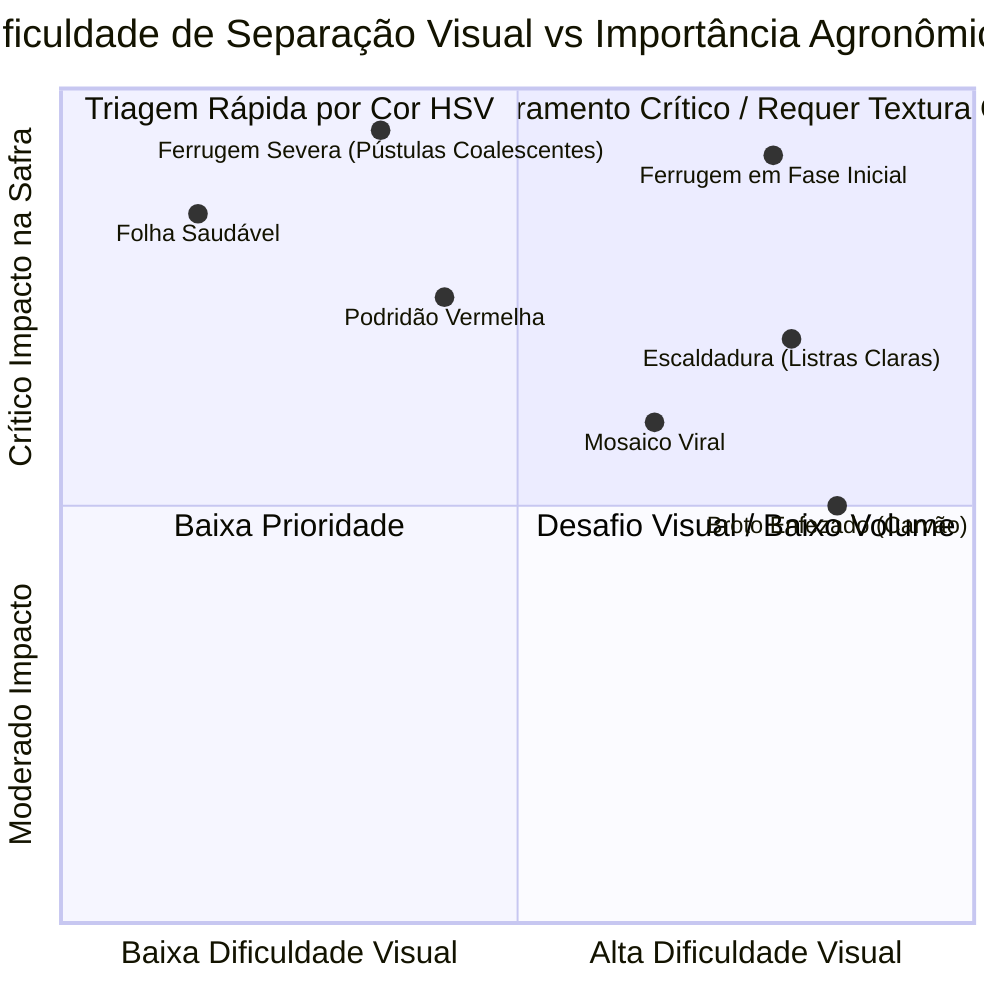
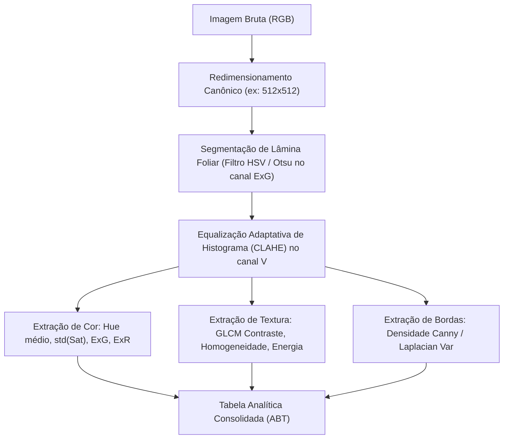

# 🔬 Análise de Padrões Visuais e Desafios de Imagem em Sanidade Vegetal

**Projeto:** Sanidade-Vegetal (SugarVision)  
**Sprint:** 1 — Setup, Sample & Explore (SEMMA)  
**Responsável:** Cesar (Domínio, Escopo e Visão Computacional)  
**Data:** 02 de Setembro de 2026  

---

## 1. Separação e Estratificação Visual das Amostras

O inventário global totalizou **6.571 imagens** catalogadas a partir das fontes *Roboflow Universe* (5.551 imagens) e *Mendeley Data* (1.020 imagens). A distribuição das classes no inventário é detalhada a seguir:

| Classe Fitopatológica | Qtd. Amostras | Proporção (%) | Domínio Visual Principal |
| :--- | :---: | :---: | :--- |
| **RED ROT (Podridão Vermelha)** | 1.268 | 19.3% | Lesões fusiformes avermelhadas com halo escuro |
| **MOSAIC (Mosaico)** | 1.257 | 19.1% | Padrão mosqueado e descoloração reticulada |
| **YELLOW LEAF (Mancha Amarela)** | 1.198 | 18.2% | Clorose acentuada ao longo da nervura dorsal |
| **HEALTHY (Saudável)** | 1.146 | 17.4% | Lâmina foliar contínua, verde túrgido e uniforme |
| **RUST (Ferrugem)** | 1.057 | 16.1% | Pústulas pontuais em relevo, castanho/laranja |
| **LEAF SCALD (Escaldadura)** | 439 | 6.7% | Listras esbranquiçadas longitudinais ("riscos") |
| **GRASSY SHOOT (Broto Enfezado)** | 206 | 3.1% | Atrofiamento vegetativo e clorose densa |
| **TOTAL** | **6.571** | **100.0%** | **Conjunto Global Integrado** |

---

## 2. Caracterização Visual Comparativa

### 2.1 Padrão Visual: Folhas Saudáveis (`HEALTHY`)
* **Morfologia & Estrutura:** Lâmina foliar uniforme com nervuras paralelas contínuas e sem interrupções mecânicas ou necróticas.
* **Assinatura Cromática (RGB/HSV):**
  * Predominância acentuada do canal **Verde (G)** sobre Vermelho (R) e Azul (B).
  * Matiz no espaço HSV concentrado na faixa de **65° a 90°** (verde-vivo a verde-escuro).
  * Baixa dispersão da Saturação ($\sigma_{\text{Sat}} < 0.15$), indicando uniformidade no tecido foliar.
* **Comportamento de Textura (GLCM):**
  * **Homogeneidade:** Elevada ($> 0.85$).
  * **Contraste / Dissimilaridade:** Baixo, devido à ausência de pústulas ou crostas fúngicas salientes.

### 2.2 Padrão Visual: Ferrugem Foliar (`RUST` — *Puccinia spp.*)
* **Morfologia & Estrutura:** Formação de urédias (pústulas em relevo) que se rompem na epiderme foliar, liberando esporos de coloração marrom-alaranjada / ferruginosa. Lesões pequenas ($0.5 \text{ a } 2.0\text{ mm}$), alongadas paralelamente às nervuras.
* **Assinatura Cromática (RGB/HSV):**
  * Quebra imediata da dominância verde: aumento abrupto do canal **Vermelho (R)** e queda do índice de excesso de verde ($ExG$).
  * Matiz (Hue) sofre um deslocamento (*shift*) para a faixa de **10° a 35°** (espectro amarelo-alaranjado a castanho).
  * Presença de halos cloróticos (amarelados) ao redor de cada pústula ativa.
* **Comportamento de Textura (GLCM):**
  * **Contraste / Dissimilaridade:** Aumento de $+45\%$ a $+80\%$ em relação à folha sadia, refletindo a rugosidade física das pústulas rompidas.
  * **Densidade de Bordas (Canny):** Picos locais provocados pelos múltiplos contornos das pequenas lesões espalhadas.

### 2.3 Padrão Visual: Patologias Concorrentes (Diagnóstico Diferencial)
* **Podridão Vermelha (`RED ROT`):** Ao contrário dos pontos dispersos da ferrugem, apresenta manchas necróticas contínuas e extensas, frequentemente com o centro acinzentado e bordas avermelhadas intensas.
* **Mosaico (`MOSAIC`):** Não há rugosidade de textura ou ruptura na cutícula; a alteração é estritamente de variação suave de tons de verde (*islands of green tissue*).
* **Mancha Amarela (`YELLOW LEAF`):** Amarelecimento contínuo e gradiente direcional a partir da nervura central.

---

## 3. Matriz de Dificuldade de Classificação Visual

### 3.1 Principais Desafios de Diagnóstico Diferencial:
1. **Ferrugem Inicial vs. Respingo de Solo / Poeira:** Lesões puntiformes em estágio inicial podem ser confundidas com partículas minerais aderidas à lâmina foliar.
2. **Ferrugem Avançada vs. Podridão Vermelha:** Quando as pústulas coalescem e necrosam, a cor castanha aproxima-se dos tecidos necrosados de podridão.

---

## 4. Análise de Fatores Fotométricos e Qualitativos da Base

### 4.1 Variação de Iluminação e Sombras
* **Iluminação Direta / Reflexo Especular:** A cutícula cerosa das folhas de cana/soja atua como espelho parcial sob incidência solar direta, gerando regiões saturadas (brancos estourados, $V = 255$) que mascaram pústulas de ferrugem.
* **Sombras Duras:** O dossel vegetativo projeta sombras de folhas sobrepostas, alterando a luminância local sem que haja patologia real.

### 4.2 Heterogeneidade de Fundo (*Background Noise*)
* Amostras da base *Roboflow* e *Mendeley* possuem 3 perfis de enquadramento:
  1. **Bancada com fundo neutro (preto/branco):** Alta facilidade de segmentação da folha ($~35\%$ da base).
  2. **Campo com fundo de solo/palhada:** Tons castanhos do solo compartilham o mesmo espaço cromático HSV das pústulas de ferrugem ($~50\%$ da base).
  3. **Presença de mão humana / luva:** Pode introduzir ruído de tonalidade avermelhada/rosada ($~15\%$ da base).

### 4.3 Disparidade de Resolução Espacial
Conforme auditado pelo script `visual_patterns_analyzer.py`:
- **5.551 imagens ($84.5\%$)** estão padronizadas em **$640 \times 640$ pixels** (fonte *Roboflow*).
- **687 imagens ($10.5\%$)** possuem resolução ultra-alta de **$6016 \times 4016$ pixels** (fonte *Mendeley*).
- **291 imagens ($4.4\%$)** possuem resolução de **$1200 \times 1600$ pixels**.

> [!IMPORTANT]
> **Decisão Metodológica:** Para extração uniforme de matrizes GLCM e filtros espaciais no pipeline do Marvin e modelo SVM, todas as imagens devem ser reamostradas para uma resolução canônica fixa de **$256 \times 256$** ou **$512 \times 512$**, preservando a proporção de aspecto (*aspect ratio*).

---

## 5. Diretrizes para Engenharia de Features e Pré-Processamento

1. **Segmentação Foliar via Máscara de Excesso de Verde ($ExG > 0$):** Isola a lâmina da folha, removendo solo e interferências de fundo antes do cálculo estatístico.
2. **Equalização de Contraste Adaptativo (CLAHE):** Mitiga sombras e homogeneíza a iluminação entre amostras de dias ensolarados e nublados.
3. **Ponderação Direcional no GLCM:** Calcular a média dos ângulos $\theta \in \{0^\circ, 45^\circ, 90^\circ, 135^\circ\}$ para garantir invariância à rotação da folha na captura.
