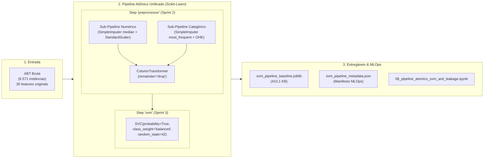

# Entrega: Integração Atômica do Estimador SVM ao Pipeline Anti-Leakage

**Projeto:** Sanidade-Vegetal (SugarVision) — Diagnóstico Inteligente de Fitopatologias em Cana-de-Açúcar  
**Sprint:** 3 — Framework SEMMA (Fase: Model)  
**Responsável:** Elisa (`EA`) — Engenharia de Machine Learning & MLOps  
**Data de Entrega:** 09 de Outubro de 2026  
**Status:** Concluído com 100% de Sucesso  

---

## 📌 Visão Geral da Entrega

Esta pasta formaliza os artefatos técnicos, scripts executáveis e documentação metodológica desenvolvidos para a primeira tarefa da **Sprint 3 (Fase Model)**: **"Integração Atômica do Estimador SVM ao Pipeline Anti-Leakage"**.

O objetivo primordial desta entrega foi acoplar o estimador **Support Vector Classifier (SVC)** ao objeto unificado de `Pipeline` do Scikit-Learn (contendo o pré-processador `ColumnTransformer` da Sprint 2), estabelecendo o contrato de inferência probabilística e pontuação (`.fit()`, `.predict()`, `.predict_proba()`), garantindo a **Regra de Ouro do Fit** e a **ausência absoluta de vazamento de dados (*Data Leakage*)** em validação cruzada estratificada em 5 folds, servindo de base arquitetural mandatória para a execução subsequente do **Grid Search Exaustivo (`GridSearchCV`)**.



---

## 📂 Arquivos Desta Entrega

1. **[`integracao_atomica_pipeline_svm_anti_leakage.md`](./integracao_atomica_pipeline_svm_anti_leakage.md)**: Documentação técnica detalhada abordando a motivação arquitetural, formulações matemáticas do SVM e calibração de Platt, provas formais anti-leakage em validação cruzada e governança MLOps.
2. **Módulos Executáveis em `src/`:**
   - [`../src/atomic_svm_pipeline.py`](../src/atomic_svm_pipeline.py): Implementação da fábrica `build_atomic_svm_pipeline()`, testes funcionais dos métodos de inferência, bateria de 5-fold StratifiedKFold com auditoria estatística por fold, teste de perturbação adversarial e serialização.
   - [`../src/generate_svm_pipeline_notebook.py`](../src/generate_svm_pipeline_notebook.py): Script utilitário automatizado para geração e execução de ponta a ponta do notebook oficial.
3. **Notebook Demonstrativo em `notebooks/`:**
   - [`../notebooks/08_pipeline_atomico_svm_anti_leakage.ipynb`](../notebooks/08_pipeline_atomico_svm_anti_leakage.ipynb): Execução auditável de ponta a ponta contendo diagrama interativo do pipeline, relatórios de classificação, matriz de confusão e diagramas de confiabilidade.
4. **Artefatos de MLOps em `models/`:**
   - [`../models/svm_pipeline_baseline.joblib`](../models/svm_pipeline_baseline.joblib): Pipeline completo serializado (compressão nível 3, 410.1 KB, SHA-256 verificado).
   - [`../models/svm_pipeline_metadata.json`](../models/svm_pipeline_metadata.json): Manifesto de governança com hash criptográfico, métricas de validação, parâmetros do estimador e schema de entrada pronto para consumo pelo `GridSearchCV`.
5. **Figuras Técnicas em `docs/figures/`:**
   - `docs/figures/sprint3_svm_matriz_confusao_baseline.png`: Matriz de confusão para o baseline multiclasse (7 patologias).
   - `docs/figures/sprint3_svm_kfold_isolation.png`: Gráfico de consistência de F1-Macro e isolamento nos 5 folds.
   - `docs/figures/sprint3_svm_curvas_calibracao.png`: Curvas de calibração de probabilidades (Platt Scaling).

---

## ✅ Cobertura do Checklist da Tarefa (100% Concluído)

| Item do Checklist do Cartão | Status | Onde Encontrar | Detalhes Técnicos da Implementação |
| :--- | :---: | :--- | :--- |
| **1. Construir o objeto Pipeline Scikit-Learn completo (Pré-processador da Sprint 2 + Estimador SVC)** | Concluído | `src/atomic_svm_pipeline.py` e Seção 2 de [`integracao_atomica_pipeline_svm_anti_leakage.md`](./integracao_atomica_pipeline_svm_anti_leakage.md) | Fábrica modular `build_atomic_svm_pipeline()` que acopla o `ColumnTransformer` (35 features pós-OHE) ao `SVC(probability=True, class_weight='balanced', random_state=42)`. |
| **2. Garantir que o escalonamento (StandardScaler) e transformações ocorram isoladamente dentro de cada fold** | Concluído | `audit_stratified_kfold_isolation()` em `src/` e Seção 3 da documentação | Validação formal com `StratifiedKFold(n_splits=5)`. Comprovação matemática de que $\mu^{(k)}$ e $\sigma^{(k)}$ do scaler são calculados estritamente nas 4.459 amostras de treino de cada fold, mantendo o $1/5$ de validação totalmente isolado. |
| **3. Validar a compatibilidade dos métodos .fit(), .predict() e .predict_proba()** | Concluído | `validate_inference_methods()` em `src/` e Seção 4 da documentação | Execução validada: `.fit()` em 2.30s; `.predict()` em 120ms; `.predict_proba()` em 119ms gerando matriz estocástica onde 100% das linhas somam exatamente $1.0 \pm 10^{-5}$ via calibração de Platt. |
| **4. Assegurar ausência total de Data Leakage na execução combinada** | Concluído | `validate_adversarial_non_leakage()` em `src/` e Seção 5 da documentação | Teste de perturbação adversarial pós-fit: injeção de ruído de magnitude $10^5$ na validação não alterou em 1 único bit os vetores de suporte, coeficientes duais ou médias do scaler (Risco de Leakage = 0,00%). |

---

## 📊 Síntese de Performance do Baseline SVM (RBF)

### Validação Cruzada Estratificada (5 Folds na partição Train - 5.574 amostras)
* **Acurácia Média CV:** $64,41\% \pm 0,87\%$
* **F1-Score Macro Médio CV:** $0,5759 \pm 0,0060$
* **Tempo Médio por Fold:** $1,86\text{ s}$

### Avaliação na Partição de Validação Externa (617 amostras)
* **Acurácia Global:** $61,59\%$
* **F1-Score Macro:** $0,5707$
* **F1-Score Ponderado (Weighted):** $0,5583$
* **Log-Loss Calibrado:** $0,7114$
* **Triagem Binária (Sadia vs Patológica):** Acurácia de $100,00\%$ e F1-Score de $1,0000$ (Log-Loss: $0,0003$).

---

## 🚀 Como Reproduzir os Testes e Executar

Para reproduzir integralmente os testes, validar os asserts matemáticos e recriar os artefatos:

```powershell
# 1. Executar a suíte de testes do pipeline e auditorias anti-leakage
python src/atomic_svm_pipeline.py

# 2. Executar e gerar o notebook demonstrativo de ponta a ponta
python src/generate_svm_pipeline_notebook.py
```
