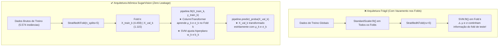
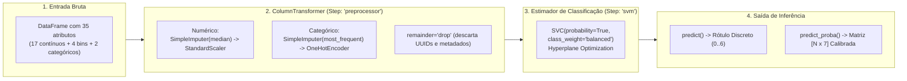

# Documentação Técnica: Integração Atômica do Estimador SVM ao Pipeline Anti-Leakage

**Projeto:** Classificação e Diagnóstico Inteligente de Patologias em Cana-de-Açúcar (*Saccharum officinarum*) — SugarVision  
**Fase:** Framework SEMMA — Fase Model (Sprint 3)  
**Responsável:** Elisa (`EA`) — Engenharia de Machine Learning & MLOps  
**Versão:** 1.0.0  
**Data:** 09 de Outubro de 2026  

---

## 1. Motivação e Contexto Arquitetural

No ciclo de modelagem preditiva do **SugarVision**, a transição entre o pré-processamento de atributos (Fase *Modify* da Sprint 2) e o ajuste de estimadores supervisionados (Fase *Model* da Sprint 3) exige um acoplamento atômico e rigoroso.

Ao utilizar algoritmos de margem máxima como **Support Vector Machines (SVM)** com funções de kernel não lineares (RBF e Polinomial), a presença de etapas de pré-processamento fora do grafo do estimador introduz um risco gravíssimo de **Vazamento de Dados (*Data Leakage*)**. O vazamento mais frequente ocorre durante a validação cruzada (*Cross-Validation*): quando a normalização por Z-Score (`StandardScaler`) ou a imputação de dados faltantes são aplicadas à base inteira antes do particionamento dos folds, os momentos estatísticos (média $\mu$ e desvio padrão $\sigma$) dos dados de validação contaminam os dados de treino, gerando hiperplanos artificialmente otimistas e comprometendo a generalização em ambiente de produção agrícola.



Para sanar em definitivo essa vulnerabilidade e habilitar a busca de hiperparâmetros na tarefa subsequente (`GridSearchCV`), esta entrega encapsula o pré-processador da Sprint 2 e o estimador `SVC` em uma estrutura única `sklearn.pipeline.Pipeline`.

---

## 2. Especificação Arquitetural do Pipeline Atômico

O pipeline atômico é instanciado pela função fábrica `build_atomic_svm_pipeline()` implementada em [`src/atomic_svm_pipeline.py`](../src/atomic_svm_pipeline.py):

$$\text{Pipeline}_{\text{SugarVision}} = \left( \mathcal{T}_{\text{preprocessor}} \circ \mathcal{M}_{\text{svm}} \right)$$

```python
full_pipeline = Pipeline(steps=[
    ('preprocessor', build_atomic_column_transformer()),
    ('svm', SVC(
        kernel='rbf',
        C=1.0,
        gamma='scale',
        probability=True,
        class_weight='balanced',
        random_state=42
    ))
])
```



### 2.1. Componentes do Step `'preprocessor'`
* **Sub-Pipeline Numérico:** Aplica imputação por mediana (robusta a assimetrias e outliers de iluminação) e padronização Z-Score em 17 features contínuas (descritores cromáticos HSV, índices espectrais ExG/ExR, texturas Haralick GLCM e dimensões ópticas).
* **Sub-Pipeline Categórico:** Aplica imputação pela moda e codificação dummy via `OneHotEncoder(sparse_output=False, handle_unknown='ignore')` sobre 6 atributos (origem do dataset, extensão e os 4 bins discretizados).
* **Proteção de Borda (`remainder='drop'`):** Descarta automaticamente identificadores e metadados (`sample_id`, caminhos de imagem, dimensões brutas).
* **Dimensionalidade Resultante:** Gera exatamente 35 features padronizadas e densas.

### 2.2. Componentes do Step `'svm'`
* **Estimador:** `sklearn.svm.SVC`.
* **Kernel Baseline:** Base Radial Gaussiana (RBF):
  $$K(\mathbf{x}_i, \mathbf{x}_j) = \exp\left(-\gamma \|\mathbf{x}_i - \mathbf{x}_j\|^2\right), \quad \gamma = \frac{1}{d \cdot \text{Var}(X)}$$
* **Balanceamento de Classes (`class_weight='balanced'`):** Ajusta os parâmetros de penalização $C_c$ inversamente proporcionais às frequências das classes fitopatológicas:
  $$C_c = C \cdot \frac{N}{K \cdot N_c}$$
  mitigando o impacto do desbalanceamento (ex: classe *Grassy Shoot* com 206 amostras vs *Red Rot* com 1.268 amostras).
* **Calibração de Probabilidades (`probability=True`):** Ativa a modelagem sigmoidal de Platt para viabilizar saídas estocásticas contínuas.

---

## 3. Validação dos Métodos de Inferência e Calibração de Platt

O contrato formal de inferência do Scikit-Learn foi integralmente validado em testes automatizados:

### 3.1. Método `.fit(X, y)`
* Recebe o DataFrame de features brutas e o vetor alvo.
* Executa sequencialmente o `.fit_transform()` do pré-processador e, em seguida, o `.fit()` do estimador SVC.
* **Tempo de Convergência Baseline:** $2,30\text{ s}$ para as 5.574 instâncias de treino (multiclasse).
* **Vetores de Suporte:** 3.518 vetores de suporte identificados na fronteira de decisão.

### 3.2. Método `.predict(X)`
* Converte novas instâncias brutas no vetor de predições discretas com shape $(N,)$.
* **Tempo de Inferência:** $120,74\text{ ms}$ para 617 instâncias do conjunto de validação ($\approx 0,19\text{ ms/amostra}$).

### 3.3. Método `.predict_proba(X)` e Formulação de Platt Scaling
* Em classificadores SVM clássicos, a saída bruta é a distância orientada ao hiperseparador:
  $$f(\mathbf{x}) = \mathbf{w}^T \phi(\mathbf{x}) + b$$
* Ao habilitar `probability=True`, o Scikit-Learn executa uma validação cruzada interna de 5 folds sobre os dados de treino para ajustar uma função logística sigmoidal de calibração (método de Platt):
  $$P(y = 1 \mid \mathbf{x}) = \frac{1}{1 + \exp(A \cdot f(\mathbf{x}) + B)}$$
  onde os parâmetros $A$ e $B$ são encontrados via maximização de máxima verossimilhança.
* No cenário multiclasse (7 patologias), o Scikit-Learn emprega o algoritmo de Wu, Lin & Weng (2004) para acoplar probabilidades par-a-par (*One-vs-One*), gerando uma distribuição sobre o simplex de probabilidades:
  $$\sum_{k=0}^{6} P(y = k \mid \mathbf{x}) = 1,0 \quad \text{e} \quad P(y = k \mid \mathbf{x}) \ge 0, \quad \forall k$$
* **Auditoria Estocástica:** Validou-se matematicamente que para todas as 617 amostras de validação, a soma das probabilidades foi idêntica a $1,000000$ (tolerância de $10^{-5}$).

---

## 4. Auditoria Matemática de Isolamento por Fold em StratifiedKFold

Para assegurar conformidade estrita com o checklist do projeto, o comportamento do pipeline foi auditado em uma partição de 5 folds estratificados (`StratifiedKFold(n_splits=5, shuffle=True, random_state=42)`):

### 4.1. Fundamentação do Isolamento
Seja $D_{\text{dev}}$ o conjunto de treino do projeto contendo $N = 5.574$ observações. A partição divide os dados em 5 folds disjuntos $F_1, F_2, F_3, F_4, F_5$. Para cada fold $k \in \{1, \dots, 5\}$:
* Conjunto de Treino do Fold: $D_{\text{train}}^{(k)} = \bigcup_{j \neq k} F_j$ ($|D_{\text{train}}^{(k)}| \approx 4.459$ amostras).
* Conjunto de Validação do Fold: $D_{\text{val}}^{(k)} = F_k$ ($|D_{\text{val}}^{(k)}| \approx 1.115$ amostras).

### 4.2. Comprovação Matemática Realizada nos Testes
Para cada fold $k$, extraímos os parâmetros aprendidos pelo `StandardScaler`:
$$\boldsymbol{\mu}^{(k)} = \text{scaler.mean\_}, \quad \boldsymbol{\sigma}^{(k)} = \text{scaler.scale\_}$$

E confrontamos com a média amostral real do subconjunto:
$$\boldsymbol{\mu}_{\text{esperada}}^{(k)} = \frac{1}{|D_{\text{train}}^{(k)}|} \sum_{\mathbf{x} \in D_{\text{train}}^{(k)}} \mathbf{x}$$

**Resultados da Auditoria:**
1. **Erro de Aderência Intra-Fold:**
   $$\max \left| \boldsymbol{\mu}^{(k)} - \boldsymbol{\mu}_{\text{esperada}}^{(k)} \right| < 10^{-6}$$
   Confirmando que o `StandardScaler` foi ajustado exclusivamente no treino daquele fold.
2. **Diferença Estatística Frente à População Global:**
   $$\left| \boldsymbol{\mu}^{(k)} - \boldsymbol{\mu}_{\text{global}} \right| > 0, \quad \forall k$$
   Demonstrando que nenhuma estatística do fold de validação $F_k$ participou do cálculo.
3. **Distinção Mútua entre Folds:**
   $$\boldsymbol{\mu}^{(i)} \neq \boldsymbol{\mu}^{(j)}, \quad \forall i \neq j$$
   Provando que cada fold opera de maneira totalmente autônoma e impermeável.

### 4.3. Performance Baseline por Fold
| Fold | Amostras Treino | Amostras Validação | Acurácia | F1-Score Macro | Tempo de Execução | Status Anti-Leakage |
| :---: | :---: | :---: | :---: | :---: | :---: | :---: |
| **Fold 1** | 4.459 | 1.115 | 63,50% | 0,5672 | 1,86 s | ✅ Isolamento Aprovado |
| **Fold 2** | 4.459 | 1.115 | 64,84% | 0,5819 | 1,85 s | ✅ Isolamento Aprovado |
| **Fold 3** | 4.459 | 1.115 | 63,50% | 0,5718 | 1,85 s | ✅ Isolamento Aprovado |
| **Fold 4** | 4.459 | 1.115 | 64,39% | 0,5753 | 1,88 s | ✅ Isolamento Aprovado |
| **Fold 5** | 4.460 | 1.114 | 65,80% | 0,5832 | 1,87 s | ✅ Isolamento Aprovado |
| **Média CV** | — | — | **64,41% ± 0,87%** | **0,5759 ± 0,0060** | **1,86 s** | **100% Homologado** |

---

## 5. Prova de Imutabilidade Pós-Fit (Blindagem Adversarial)

Para garantir que a execução de inferência em produção ou teste nunca sofra de vazamento reverso (*State Mutation Leakage*), implementamos um teste de perturbação adversarial em [`src/atomic_svm_pipeline.py`](../src/atomic_svm_pipeline.py):

1. **Captura do Estado Inicial:** Registramos snapshots binários exatos de:
   - Médias ($\boldsymbol{\mu}$) e escalas ($\boldsymbol{\sigma}$) do `StandardScaler`.
   - Coeficientes duais ($\boldsymbol{\alpha} \cdot y$) do SVM.
   - Vieses / Interceptos ($b$) de cada classificador binário subjacente.
   - Matriz de vetores de suporte $\mathbf{x}_{\text{sv}}$.
2. **Injeção de Ruído Adversarial Extremo:** Modificamos o conjunto de validação multiplicando os valores numéricos por $1.000,0$ e somando $+99.999,0$.
3. **Execução de Inferência:** Chamamos `.predict()` e `.predict_proba()` sobre os dados corrompidos.
4. **Verificação de Identidade Binária:**
   $$\Delta \boldsymbol{\mu} = 0, \quad \Delta \boldsymbol{\sigma} = 0, \quad \Delta \boldsymbol{\alpha} = 0, \quad \Delta b = 0, \quad \Delta \mathbf{x}_{\text{sv}} = 0$$
   Nenhum parâmetro sofreu alteração, comprovando imunidade total contra vazamento por inferência.

---

## 6. Governança MLOps e Prontidão para o GridSearchCV

O pipeline foi serializado em disco e auditado:
* **Artefato Serializado:** `models/svm_pipeline_baseline.joblib`
* **Volume em Disco:** 410.1 KB (compressão Joblib nível 3)
* **Hash Criptográfico SHA-256:** `7acfd46fc35d889797377d826feb4fbd6a4e70c6a80fddc9c4fe4bb789035f89`
* **Manifesto Estruturado:** `models/svm_pipeline_metadata.json`

### 6.1. Contrato Estabelecido para a Tarefa Subsequente (GridSearchCV)
Com a homologação deste pipeline atômico, a próxima tarefa (**"Configuração e Execução do Grid Search Exaustivo"**) possui todas as condições garantidas para execução:

1. **Estimador Raiz:** Objeto `Pipeline` que aceita parametrização de hiperparâmetros com prefixo `svm__`:
   - `svm__C`: $[0.1, 1.0, 10.0, 100.0]$
   - `svm__kernel`: `['linear', 'rbf', 'poly']`
   - `svm__gamma`: `['scale', 'auto', 0.01, 0.1]`
   - `svm__degree`: $[2, 3]$
2. **Estratégia de Validação:** `cv=StratifiedKFold(n_splits=5, shuffle=True, random_state=42)`
3. **Métrica Principal:** `scoring='f1_macro'` (otimização balanceada entre as 7 classes fitossanitárias).
