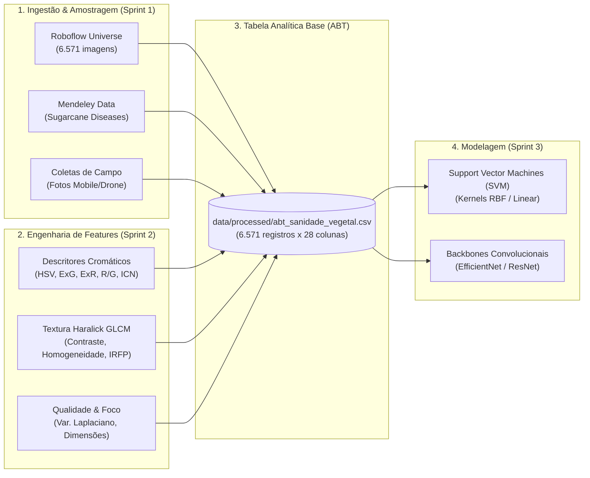
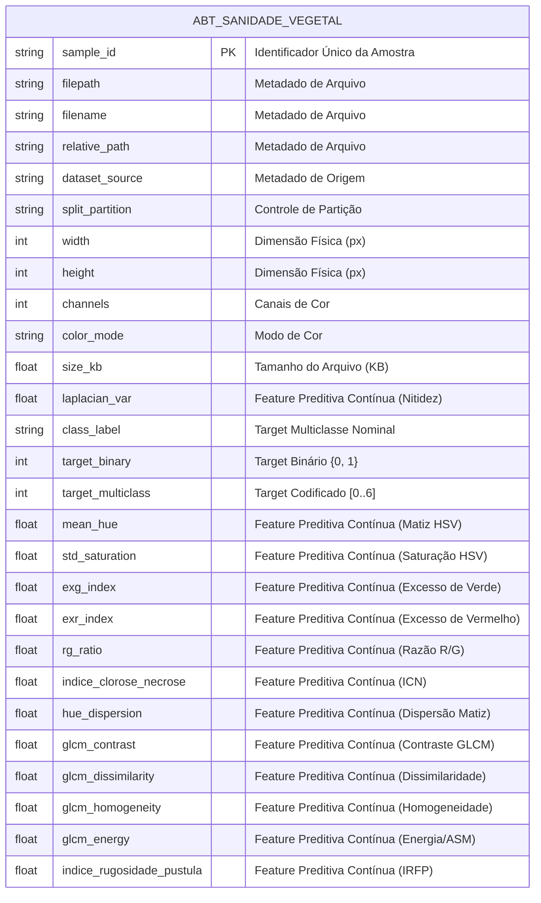

# 📖 Dicionário de Dados — Sanidade Vegetal (SugarVision)

**Projeto:** Classificação e Diagnóstico Inteligente de Patologias em Cana-de-Açúcar (*Saccharum officinarum*)  
**Fase:** Framework SEMMA — Fase Modify & Engenharia de Atributos (Sprint 2)  
**Versão:** 2.0.0  
**Data:** Setembro de 2026  
**Responsáveis:** Cesar (Lead Técnico & Visão Computacional) e Equipe de Ciência de Dados  

---

## 1. Contextualização e Estrutura de Dados no Repositório

O projeto **Sanidade-Vegetal (SugarVision)** processa imagens digitais em alta resolução e metadados contextuais de lavouras de cana-de-açúcar para diagnosticar, classificar e estimar a severidade de fitopatologias foliares, com foco primordial na discriminação entre tecidos foliares sadios e lesões provocadas pela **Ferrugem da Cana-de-Açúcar (*Puccinia melanocephala* e *Puccinia kuehnii*)**, além de outras patologias associadas.

### 📚 Fontes Oficiais de Dados e Validação Externa:
1. **Roboflow Universe — *Sugarcane Disease Classification*:**
   * **Mantenedor:** Asad Unvar ([Roboflow Universe](https://universe.roboflow.com/asad-unvar/sugarcane-disease-classification)).
   * **Volumetria:** 6.571 imagens particionadas em `train/` (70%), `valid/` (15%) e `test/` (15%).
   * **Patologias Cobertas:** *Healthy* (Sadia), *Rust* (Ferrugem), *Red Rot* (Podridão Vermelha), *Mosaic Virus* (Mosaico) e *Yellow Leaf* (Amarelecimento Foliar).
2. **Mendeley Data — *Sugarcane Diseases* (DOI: [10.17632/rzh99cj2rj.1](https://doi.org/10.17632/rzh99cj2rj.1)):**
   * **Autores:** Ijaz Kalhoro, Rafaqat Hussain e Hidayatullah Shaikh.
   * **Patologias Cobertas:** *Red Rot*, *Smut* (Carvão), *Leaf Scald* (Escaldadura) e *Healthy*.

### 📂 Alocação dos Dados no Repositório:
* **`data/raw/`**: Imagens e anotações originais intactas.
* **`data/processed/abt_sanidade_vegetal.csv`**: Tabela Analítica Base (ABT) consolidada com 6.571 instâncias e 28 atributos estruturados em estrito formato `snake_case`.
* **`src/feature_engineering_visual.py`**: Pipeline executável de transformação de dados e geração das features cromáticas e texturais.
* **`docs/figures/`**: Visualizações diagnósticas de separabilidade estatística e dispersão.

---

## 2. Modelagem Conceitual da Tabela Analítica Base (ABT)

A **Tabela Analítica Base (ABT)** unifica em uma única visão tabular plana (*flat table*) todas as dimensões do domínio:

---

## 3. Classificação dos Papéis Analíticos das Variáveis

Cada coluna da base de dados desempenha uma função técnica e analítica estritamente delimitada no pipeline de modelagem preditiva:

| Papel Analítico | Definição | Exemplo no Projeto SugarVision |
| :--- | :--- | :--- |
| **Identificador** | Chave primária ou estrangeira que identifica unicamente a observação no banco. Não deve ser usada como preditor. | `sample_id`, `planta_id`, `talhao_id`, `coleta_id` |
| **Metadado Técnico / Controle** | Atributos operacionais do arquivo, controle de split de dados e procedência. Utilizados para governança e prevenção de vazamento. | `filepath`, `relative_path`, `dataset_source`, `split_partition`, `channels`, `color_mode`, `extension` |
| **Target** | Variável resposta agronômica que o modelo é treinado para prever (seja multiclasse, binária ou contínua). | `class_label`, `target_binary`, `target_multiclass`, `target_grau_severidade_pct` |
| **Feature Preditiva Contínua** | Variável numérica contínua em escala de intervalo ou razão, representativa do sinal biofísico, espectral ou morfológico. | `exg_index`, `exr_index`, `mean_hue`, `std_saturation`, `glcm_contrast`, `glcm_homogeneity`, `indice_rugosidade_pustula`, `laplacian_var`, `size_kb` |
| **Feature Preditiva Discreta** | Variável numérica discreta ou categórica ordinal que representa contagens ou níveis escalonados. | `width`, `height`, `posicao_linha`, `idade_dias`, `lesion_bbox_count`, `estadio_fenologico` |

---

## 4. Catálogo Formal e Detalhado das Variáveis

A tabela a seguir consolida o catálogo completo de variáveis da Tabela Analítica Base (ABT) e das entidades complementares de contexto agronômico:

| Entidade / Bloco | Nome da Coluna (`snake_case`) | Tipo Primitivo | Tipo Estatístico | Papel Analítico | Fórmula / Algoritmo de Extração | Unidade de Medida | Intervalo Teórico | Descrição e Interpretação Agronômica | Permite Nulo |
| :--- | :--- | :--- | :--- | :--- | :--- | :--- | :--- | :--- | :---: |
| **ABT** | `sample_id` | `VARCHAR(64)` | Identificador | **Identificador** | $\text{UUID v4}$ ou $\text{SMP}_{i}$ | Adimensional (Hash) | String alfanumérica única | Identificador exclusivo primário de cada amostra foliar na ABT. | Não |
| **ABT** | `filepath` | `VARCHAR(255)` | Texto / Path | **Metadado Técnico** | `os.path.abspath(raw_file)` | Caminho de arquivo | String válida no SO | Localização física absoluta da imagem no disco local. | Não |
| **ABT** | `filename` | `VARCHAR(128)` | Texto | **Metadado Técnico** | `os.path.basename(filepath)` | Nome de arquivo | String com extensão | Nome do arquivo original de imagem com sua respectiva extensão. | Não |
| **ABT** | `relative_path` | `VARCHAR(255)` | Texto / URI | **Metadado Técnico** | `os.path.relpath(filepath, repo)` | Caminho relativo | URI válida no repo | Caminho relativo padronizado para execução em pipelines reprodutíveis. | Não |
| **ABT** | `dataset_source` | `VARCHAR(32)` | Categórica Nominal | **Metadado Técnico** | Rastreamento de ingestão | Categoria | `{'Roboflow', 'Mendeley_Data'}` | Fonte pública ou privada de procedência do lote da imagem. | Não |
| **ABT** | `split_partition` | `VARCHAR(16)` | Categórica Nominal | **Metadado Técnico** | Particionamento estratificado | Categoria | `{'train', 'valid', 'test'}` | Partição de Machine Learning para treinamento, validação e teste cego. | Não |
| **ABT** | `extension` | `VARCHAR(8)` | Categórica Nominal | **Metadado Técnico** | `os.path.splitext()[1]` | Extensão gráfica | `{'jpg', 'jpeg', 'png'}` | Formato de encapsulamento e compressão da imagem. | Não |
| **ABT** | `width` | `INTEGER` | Numérica Discreta | **Feature Preditiva Discreta** | Largura da matriz da imagem | Pixels (px) | $[1, 8000]$ | Dimensão horizontal original da imagem capturada. | Não |
| **ABT** | `height` | `INTEGER` | Numérica Discreta | **Feature Preditiva Discreta** | Altura da matriz da imagem | Pixels (px) | $[1, 8000]$ | Dimensão vertical original da imagem capturada. | Não |
| **ABT** | `channels` | `INTEGER` | Numérica Discreta | **Metadado Técnico** | Profundidade de canais | Canais | `3` (RGB) | Quantidade de bandas espectrais da imagem fotográfica. | Não |
| **ABT** | `color_mode` | `VARCHAR(8)` | Categórica Nominal | **Metadado Técnico** | Modo nativo de leitura | Categoria | `{'RGB', 'RGBA', 'L'}` | Espaço nativo de representação digital da imagem. | Não |
| **ABT** | `size_kb` | `FLOAT` | Numérica Contínua | **Feature Preditiva Contínua** | $\text{Bytes} / 1024.0$ | Kilobytes (KB) | $]0.0, 50000.0]$ | Peso em disco do arquivo de imagem compactado. | Não |
| **ABT** | `laplacian_var` | `FLOAT` | Numérica Contínua | **Feature Preditiva Contínua** | $\text{Var}(\nabla^2 I_{\text{cinza}})$ | Adimensional ($\sigma^2$) | $[0.0, 10000.0]$ | Variância do operador de Laplace; quantifica nitidez e foco da captura. | Não |
| **ABT** | `class_label` | `VARCHAR(32)` | Categórica Nominal | **Target** | Laudo fitopatológico emitido | Categoria | `{'HEALTHY', 'RUST', ...}` | Nome padronizado em caixa alta da patologia foliar diagnosticada. | Não |
| **ABT** | `target_binary` | `INTEGER` | Binária / Booleana | **Target** | $\mathbb{I}(\text{class\_label} \neq \text{'HEALTHY'})$ | Binário $\{0, 1\}$ | $\{0, 1\}$ | Indicador binário de infecção fitossanitária ($0$: Sadia, $1$: Doente). | Não |
| **ABT** | `target_multiclass` | `INTEGER` | Categórica Discreta | **Target** | `pd.Categorical.codes` | Discreto (ID) | $\{0, 1, 2, 3, 4, 5, 6\}$ | Rótulo ordinal para funções de perda multiclasse (*Cross-Entropy*). | Não |
| **ABT** | `target_grau_severidade_pct` | `FLOAT` | Numérica Contínua | **Target** | $\frac{\text{Área Lesionada}}{\text{Área Foliar Total}} \times 100$ | Percentual (%) | $[0.0, 100.0]$ | Percentual da superfície do limbo foliar coberto por lesões patológicas. | Sim |
| **ABT** | `confianca_anotacao` | `FLOAT` | Numérica Contínua | **Metadado Técnico** | Concordância de laudo | Probabilidade | $[0.0, 1.0]$ | Nível de concordância e certeza atribuído pelo especialista fitopatologista. | Sim |
| **ABT** | `tem_sintoma_visivel` | `BOOLEAN` | Binária | **Metadado Técnico** | Inspeção visual macroscópica | Booleano | `True \| False` | Flag indicando se a folha apresenta sintoma evidente a olho nu. | Não |
| **ABT** | `mean_hue` | `FLOAT` | Numérica Contínua | **Feature Preditiva Contínua** | $\frac{1}{N}\sum H_i$ no espaço HSV | Graus angulares ($^\circ$) | $[0.0^\circ, 180.0^\circ]$ | Matiz médio foliar; discrimina o verde sadio ($75^\circ$) de tons de ferrugem ($24^\circ$). | Não |
| **ABT** | `std_saturation` | `FLOAT` | Numérica Contínua | **Feature Preditiva Contínua** | $\sqrt{\frac{1}{N}\sum (S_i - \mu_S)^2}$ | Adimensional | $[0.0, 1.0]$ | Desvio padrão da saturação; mede contraste pontual entre pústula e lâmina. | Não |
| **ABT** | `exg_index` | `FLOAT` | Numérica Contínua | **Feature Preditiva Contínua** | $2G - R - B$ | Nível de intensidade | $[-510.0, 510.0]$ | Índice de Excesso de Verde; mede densidade de clorofila no tecido sadio. | Não |
| **ABT** | `exr_index` | `FLOAT` | Numérica Contínua | **Feature Preditiva Contínua** | $1.4R - G$ | Nível de intensidade | $[-255.0, 357.0]$ | Índice de Excesso de Vermelho; capta oxidação tecidual e esporulação fúngica. | Não |
| **ABT** | `rg_ratio` | `FLOAT` | Numérica Contínua | **Feature Preditiva Contínua** | $\frac{R}{G + \epsilon} \approx 1 + \frac{ExR - ExG}{100}$ | Adimensional (Razão) | $[0.0, +\infty[$ (prático: $[0.2, 4.0]$) | Razão espectral Vermelho/Verde; quantifica clorose e destruição pigmentar. | Não |
| **ABT** | `indice_clorose_necrose`| `FLOAT`| Numérica Contínua | **Feature Preditiva Contínua** | $\frac{\text{rg\_ratio}}{\text{std\_saturation} + \epsilon}$ | Adimensional | $[0.0, +\infty[$ | Índice Composto ICN integrando amarelecimento espectral e dispersão de cor. | Não |
| **ABT** | `hue_dispersion` | `FLOAT` | Numérica Contínua | **Feature Preditiva Contínua** | $\text{mean\_hue} \times \text{std\_saturation}$ | Graus $\times$ Saturação | $[0.0, 180.0]$ | Dispersão do matiz combinando tonalidade e pureza cromática. | Não |
| **ABT** | `glcm_contrast` | `FLOAT` | Numérica Contínua | **Feature Preditiva Contínua** | $\sum_{i,j} \|i - j\|^2 p(i,j)$ | Adimensional ($\text{Cinza}^2$) | $[0.0, 65025.0]$ | Contraste de Haralick; quantifica o salto de intensidade de cinza entre vizinhos. | Não |
| **ABT** | `glcm_dissimilarity`| `FLOAT`| Numérica Contínua | **Feature Preditiva Contínua** | $\sum_{i,j} \|i - j\| p(i,j)$ | Adimensional ($\text{Cinza}$) | $[0.0, 255.0]$ | Dissimilaridade de Haralick; mede descontinuidade linear do limbo foliar. | Não |
| **ABT** | `glcm_homogeneity` | `FLOAT` | Numérica Contínua | **Feature Preditiva Contínua** | $\sum_{i,j} \frac{p(i,j)}{1 + \|i-j\|^2}$ | Adimensional | $[0.0, 1.0]$ | Homogeneidade de Haralick; avalia a lisura contínua da cutícula vegetal. | Não |
| **ABT** | `glcm_energy` | `FLOAT` | Numérica Contínua | **Feature Preditiva Contínua** | $\sqrt{\sum_{i,j} p(i,j)^2}$ | Adimensional | $[0.0, 1.0]$ | Energia de Haralick / Segundo Momento Angular ASM (repetição de padrão). | Não |
| **ABT** | `indice_rugosidade_pustula`| `FLOAT`| Numérica Contínua | **Feature Preditiva Contínua** | $\frac{\text{contrast} \times \text{dissimilarity}}{\text{homogeneity} + \epsilon}$ | Adimensional | $[0.0, +\infty[$ | Índice IRFP amplificando relevo microestrutural rugoso provocado por pústulas. | Não |
| **ABT** | `total_pixels` | `INTEGER` | Numérica Discreta | **Feature Preditiva Discreta** | $\text{width} \times \text{height}$ | Pixels (px) | $[409600, 24160256]$ | Quantidade total de elementos de imagem da matriz da fotografia original. | Não |
| **ABT** | `resolution_mp` | `FLOAT` | Numérica Contínua | **Feature Preditiva Contínua** | $\text{total\_pixels} / 10^6$ | Megapixels (MP) | $[0.41, 24.16]$ | Resolução espacial contínua expressa em milhões de pixels. | Não |
| **ABT** | `aspect_ratio` | `FLOAT` | Numérica Contínua | **Feature Preditiva Contínua** | $\text{width} / \text{height}$ | Razão adimensional | $[0.49, 2.76]$ | Razão de aspecto entre largura e altura da imagem. | Não |
| **ABT** | `size_kb_bin` | `INTEGER` | Categórica Ordinal | **Feature Preditiva Discreta** | $\text{KBinsDiscretizer}(\text{quantile}, k=4)$ | Faixa ordinal $[0, 3]$ | $\{0, 1, 2, 3\}$ | Discretização em 4 quartis de volume de arquivo (Muito Leve a Pesado). | Não |
| **ABT** | `laplacian_var_bin` | `INTEGER` | Categórica Ordinal | **Feature Preditiva Discreta** | $\text{KBinsDiscretizer}(\text{quantile}, k=4)$ | Faixa ordinal $[0, 3]$ | $\{0, 1, 2, 3\}$ | Discretização em 4 quartis de nitidez/foco fotográfico (Blur Leve a Ultra Foco). | Não |
| **ABT** | `resolution_bin` | `INTEGER` | Categórica Ordinal | **Feature Preditiva Discreta** | $\text{KBinsDiscretizer}(\text{kmeans}, k=3)$ | Faixa ordinal $[0, 2]$ | $\{0, 1, 2\}$ | Discretização em 3 tiers físicos de resolução (Baixa 640px, Média, Alta DSLR). | Não |
| **ABT** | `aspect_ratio_bin` | `INTEGER` | Categórica Ordinal | **Feature Preditiva Discreta** | $\text{KBinsDiscretizer}(\text{kmeans}, k=3)$ | Faixa ordinal $[0, 2]$ | $\{0, 1, 2\}$ | Discretização em 3 orientações geométricas (Retrato, Quadrado, Paisagem). | Não |
| **CONTEXTO** | `talhao_id` | `VARCHAR(64)` | Identificador | **Identificador** | Atribuição cadastral | Adimensional (Código) | String alfanumérica única | Identificador único do talhão ou gleba agrícola no sistema da usina. | Não |
| **CONTEXTO** | `fazenda_nome` | `VARCHAR(128)` | Categórica Nominal | **Metadado Técnico** | Cadastro da propriedade | Texto | Nomes cadastrados | Nome da usina sucroalcooleira ou propriedade rural onde está o plantio. | Não |
| **CONTEXTO** | `latitude` | `FLOAT` | Numérica Contínua | **Feature Preditiva Contínua** | Receptor GNSS / WGS84 | Graus decimais ($^\circ$) | $[-90.0^\circ, +90.0^\circ]$ | Coordenada geográfica de latitude do talhão agrícola. | Sim |
| **CONTEXTO** | `longitude` | `FLOAT` | Numérica Contínua | **Feature Preditiva Contínua** | Receptor GNSS / WGS84 | Graus decimais ($^\circ$) | $[-180.0^\circ, +180.0^\circ]$ | Coordenada geográfica de longitude do talhão agrícola. | Sim |
| **CONTEXTO** | `variedade_cultivar` | `VARCHAR(64)` | Categórica Nominal | **Feature Preditiva Discreta** | Cadastro agronômico | Código RIDESA / CTC | Cultivares registradas | Código da variedade genética da cana (*cultivar*) monitorada. | Sim |
| **CONTEXTO** | `tipo_solo` | `VARCHAR(64)` | Categórica Nominal | **Feature Preditiva Discreta** | Levantamento SiBCS | Texto | Ordens do SiBCS | Classificação pedológica do solo predominante na gleba. | Sim |
| **CONTEXTO** | `planta_id` | `VARCHAR(64)` | Identificador | **Identificador** | Código de amostragem | Adimensional (Código) | String alfanumérica | Identificador da planta/touceira específica monitorada no talhão. | Não |
| **CONTEXTO** | `posicao_linha` | `INTEGER` | Numérica Discreta | **Feature Preditiva Discreta** | Posição física na linha | Linha (unidade) | $[1, 1000]$ | Número da linha física de cultivo dentro do talhão. | Sim |
| **CONTEXTO** | `estadio_fenologico` | `VARCHAR(32)` | Categórica Ordinal | **Feature Preditiva Discreta** | Avaliação agronômica | Estágio fenológico | `{'Brotação', 'Perfilhamento', ...}` | Fase fenológica de desenvolvimento vegetativo da cana-de-açúcar. | Sim |
| **CONTEXTO** | `idade_dias` | `INTEGER` | Numérica Discreta | **Feature Preditiva Contínua** | $\text{Data}_{\text{Coleta}} - \text{Data}_{\text{Corte}}$ | Dias | $[0, 730]$ | Idade da planta em dias decorridos desde o corte ou plantio. | Sim |
| **CONTEXTO** | `coleta_id` | `VARCHAR(64)` | Identificador | **Identificador** | Identificador de lote | Adimensional (Código) | String alfanumérica | Identificador exclusivo da sessão/voo de captura fotográfica em campo. | Não |
| **CONTEXTO** | `data_hora_captura` | `DATETIME` | Temporal | **Metadado Técnico** | Timestamp UTC | DataHora (ISO-8601) | Datas de safra válidas | Data e horário precisos da realização da captura fotográfica em campo. | Não |
| **CONTEXTO** | `temperatura_celsius`| `FLOAT` | Numérica Contínua | **Feature Preditiva Contínua** | Sensor agroclimático | Graus Celsius ($^\circ\text{C}$) | $[0.0^\circ\text{C}, 55.0^\circ\text{C}]$ | Temperatura ambiente instantânea no momento da amostragem em campo. | Sim |
| **CONTEXTO** | `umidade_relativa_pct`| `FLOAT` | Numérica Contínua | **Feature Preditiva Contínua** | Higrômetro calibrado | Percentual (%) | $[0.0\%, 100.0\%]$ | Umidade relativa do ar registrada no instante da captura. | Sim |
| **CONTEXTO** | `responsavel_coleta`| `VARCHAR(128)` | Categórica Nominal | **Metadado Técnico** | Cadastro de operadores | Texto | Operadores autorizados | Nome do agrônomo ou técnico que executou o protocolo de coleta. | Sim |
| **CONTEXTO** | `lesion_bbox_count` | `INTEGER` | Numérica Discreta | **Feature Preditiva Discreta** | Contagem de detecções | Focos de lesão | $[0, 500]$ | Contagem de focos pontuais de infecção detectados na folha. | Sim |
| **CONTEXTO** | `embedding_vector` | `ARRAY[FLOAT]` | Vetor / Tensor | **Feature Preditiva Contínua** | Backbone CNN / ViT | Espaço latente denso | $[-\infty, +\infty]^{512}$ | Vetor denso de features profundas extraído por redes neurais pré-treinadas. | Sim |

---

## 5. Formulações Matemáticas, Unidades e Intervalos Teóricos

Nesta seção detalham-se as bases matemáticas, fundamentações biofísicas e formulações dos novos atributos desenvolvidos na **Sprint 2 (Fase Modify)**:

### 5.1 Descritores do Espaço HSV (Hue, Saturation, Value)
A conversão do espaço RGB para o modelo cilíndrico HSV desacopla o componente cromático puro (**Hue**) da pureza (**Saturation**) e da intensidade luminosa (**Value**):

$$\mu_{\text{Hue}} = \frac{1}{N} \sum_{i=1}^N H_i, \quad \sigma_{\text{Sat}} = \sqrt{\frac{1}{N}\sum_{i=1}^N (S_i - \mu_S)^2}$$

* **`mean_hue`**:
  * **Fórmula:** Média aritmética dos valores angulares de Matiz do canal $H$.
  * **Unidade de Medida:** Graus angulares ($^\circ$). No OpenCV, normalizado para o intervalo $[0.0^\circ, 180.0^\circ]$ correspondendo a $[0^\circ, 360^\circ]$.
  * **Intervalo Teórico:** $[0.0, 180.0]$.
  * **Interpretação Biofísica:** Folhas sadias concentram-se no setor verde ($\mu_{\text{Hue}} \approx 75.0^\circ$). Lesões de ferrugem provocam deslocamento hipocrômico acentuado para tons alaranjados e ferruginosos ($\mu_{\text{Hue}} \approx 22.0^\circ - 26.0^\circ$).
* **`std_saturation`**:
  * **Fórmula:** Desvio padrão do canal de Saturação $S$.
  * **Unidade de Medida:** Adimensional normalizada ($[0.0, 1.0]$).
  * **Intervalo Teórico:** $[0.0, 1.0]$.
  * **Interpretação Biofísica:** Em folhas sadias, a saturação é suave e homogênea ($\sigma_{\text{Sat}} \approx 0.12$). A presença de pústulas pontuais rompe a homogeneidade, elevando a variância da pureza cromática ($\sigma_{\text{Sat}} \approx 0.28$).

### 5.2 Índices Espectrais de Vegetação Visível ($ExG$, $ExR$, Razão $R/G$)
Como sensores RGB comuns de campo capturam bandas nas faixas do Vermelho ($R$), Verde ($G$) e Azul ($B$), foram derivados índices fotométricos diferenciais:

* **`exg_index` (Excess Green Index):**
  $$ExG = 2G - R - B$$
  * **Unidade de Medida:** Nível de intensidade diferencial de cinza.
  * **Intervalo Teórico:** $[-510.0, +510.0]$ (em canais uint8 de 0 a 255).
  * **Interpretação Biofísica:** Mede diretamente o conteúdo relativo de clorofila ativa. Folhas sadias apresentam valores fortemente positivos ($ExG > 35.0$). A esporulação e necrose destroem o parênquima verde, colapsando o índice para valores próximos a zero ou negativos ($ExG \approx 8.0$).
* **`exr_index` (Excess Red Index):**
  $$ExR = 1.4R - G$$
  * **Unidade de Medida:** Nível de intensidade diferencial de cinza.
  * **Intervalo Teórico:** $[-255.0, +357.0]$.
  * **Interpretação Biofísica:** Amplifica a assinatura visual de pigmentos oxidados (uredósporos ferruginosos e antocianinas de estresse). Elevado em folhas doentes ($ExR > 20.0$) e negativo em folhas sadias ($ExR \approx -15.0$).
* **`rg_ratio` (Razão Espectral Vermelho / Verde):**
  $$\text{Razão } R/G = \frac{R}{G + \epsilon} \approx 1.0 + \frac{ExR - ExG}{100.0}$$
  * **Unidade de Medida:** Adimensional (Razão fotométrica).
  * **Intervalo Teórico:** $[0.0, +\infty[$; na prática agrícola $[0.2, 4.0]$.
  * **Interpretação Biofísica:** Avalia a perda relativa da banda de absorção fotossintética verde em relação à refletância avermelhada.
* **`indice_clorose_necrose` (ICN):**
  $$ICN = \frac{\text{Razão } R/G}{\sigma_{\text{Sat}} + \epsilon}$$
  * **Unidade de Medida:** Adimensional.
  * **Intervalo Teórico:** $[0.0, +\infty[$.
  * **Interpretação Biofísica:** Índice composto que combina a intensidade do amarelecimento com a fragmentação textural das manchas foliares.
* **`hue_dispersion`:**
  $$\text{Hue Dispersion} = \mu_{\text{Hue}} \times \sigma_{\text{Sat}}$$
  * **Unidade de Medida:** Graus $\times$ Saturação ($[0.0, 180.0]$).
  * **Intervalo Teórico:** $[0.0, 180.0]$.
  * **Interpretação Biofísica:** Termo de interação multivariada que combina matiz angular e dispersão de pureza de cor.

### 5.3 Descritores de Textura de Haralick via GLCM (Gray-Level Co-occurrence Matrix)
A matriz de co-ocorrência $P(i, j \mid d=1, \theta)$ calcula a frequência com que um pixel de intensidade $i$ é adjacente a um pixel de intensidade $j$. Para garantir invariância à orientação física da folha na fotografia, a matriz é computada em quatro direções angulares $\theta \in \{0^\circ, 45^\circ, 90^\circ, 135^\circ\}$ e normalizada para somatório unitário $p(i, j) = \frac{P(i, j)}{\sum_{i,j} P(i, j)}$:

* **`glcm_contrast` (Contraste Haralick):**
  $$\text{Contraste} = \sum_{i=0}^{N_g-1} \sum_{j=0}^{N_g-1} |i - j|^2 \cdot p(i, j)$$
  * **Unidade de Medida:** Adimensional ($\text{Intensidade}^2$).
  * **Intervalo Teórico:** $[0.0, (N_g - 1)^2]$ (para 256 níveis: $[0.0, 65025.0]$; intervalo prático na folha: $[5.0, 120.0]$).
  * **Interpretação Biofísica:** Mede a magnitude das variações bruscas de cinza locais. Folhas acometidas por ferrugem exibem pústulas circundadas por bordas escuras, gerando salto drástico de contraste ($\mu_{\text{Ferrugem}} \approx 38.0$) frente à cutícula lisa e suave da folha sadia ($\mu_{\text{Sadia}} \approx 12.5$).
* **`glcm_dissimilarity` (Dissimilaridade Haralick):**
  $$\text{Dissimilaridade} = \sum_{i=0}^{N_g-1} \sum_{j=0}^{N_g-1} |i - j| \cdot p(i, j)$$
  * **Unidade de Medida:** Adimensional ($\text{Intensidade}$).
  * **Intervalo Teórico:** $[0.0, N_g - 1]$ ($[0.0, 255.0]$; prático: $[0.5, 30.0]$).
  * **Interpretação Biofísica:** Medida linear da descontinuidade da lâmina foliar.
* **`glcm_homogeneity` (Homogeneidade / IDM):**
  $$\text{Homogeneidade} = \sum_{i=0}^{N_g-1} \sum_{j=0}^{N_g-1} \frac{p(i, j)}{1 + |i - j|^2}$$
  * **Unidade de Medida:** Adimensional normalizada ($[0.0, 1.0]$).
  * **Intervalo Teórico:** $[0.0, 1.0]$.
  * **Interpretação Biofísica:** Expressa a suavidade da superfície foliar. Muito alta em tecidos sadios ($\approx 0.88$) e fortemente degradada pela erupção de pústulas fúngicas ($\approx 0.55$).
* **`glcm_energy` (Energia / Segundo Momento Angular ASM):**
  $$\text{Energia} = \sqrt{\text{ASM}} = \sqrt{\sum_{i=0}^{N_g-1} \sum_{j=0}^{N_g-1} p(i, j)^2}$$
  * **Unidade de Medida:** Adimensional normalizada ($[0.0, 1.0]$).
  * **Intervalo Teórico:** $[0.0, 1.0]$.
  * **Interpretação Biofísica:** Mede a regularidade e repetitividade visual da textura do limbo.
* **`indice_rugosidade_pustula` (IRFP - Índice de Rugosidade Foliar de Pústula):**
  $$IRFP = \frac{\text{Contraste} \times \text{Dissimilaridade}}{\text{Homogeneidade} + \epsilon}$$
  * **Unidade de Medida:** Adimensional.
  * **Intervalo Teórico:** $[0.0, +\infty[$ (intervalo prático: $[10.0, 2000.0]$).
  * **Interpretação Biofísica:** Métrica composta com efeito de amplificação não-linear da rugosidade tecidual. Folhas sadias apresentam $IRFP \approx 25.0$, enquanto folhas atacadas por ferrugem saltam para $IRFP > 400.0$, estabelecendo excelente separabilidade para hiperplanos SVM.

### 5.4 Métrica de Foco e Qualidade Fotográfica (`laplacian_var`)
* **`laplacian_var` (Variância do Laplaciano):**
  $$\text{Var}(\nabla^2 I) = \frac{1}{HW}\sum_{x,y} \left( \nabla^2 I(x, y) - \mu_{\nabla^2} \right)^2, \quad \text{onde } \nabla^2 I = \frac{\partial^2 I}{\partial x^2} + \frac{\partial^2 I}{\partial y^2}$$
  * **Unidade de Medida:** Adimensional ($\sigma^2$ de gradiente de segunda ordem).
  * **Intervalo Teórico:** $[0.0, 10000.0]$ (prático: $[20.0, 800.0]$).
  * **Interpretação Biofísica e Fotográfica:** Quantifica o conteúdo de alta frequência espacial na imagem. Valores inferiores a $40.0$ apontam desfoque (*motion blur* ou erro de foco ótico), servindo como filtro de qualidade antes da inferência agronômica.

---

## 6. Regras de Negócio, Integridade e Validação de Dados

1. **Relação Biunívoca entre Targets:**
   * Toda instância com `class_label == 'HEALTHY'` deve obrigatoriamente possuir `target_binary == 0`, `target_multiclass == 0` e `target_grau_severidade_pct == 0.0`.
   * Toda instância com `class_label != 'HEALTHY'` deve possuir `target_binary == 1` e `target_multiclass > 0`.
2. **Prevenção de Vazamento de Dados (*Data Leakage*):**
   * Amostras originadas da mesma touceira (`planta_id`) ou capturadas no mesmo talhão (`talhao_id`) em uma mesma data de inspeção não podem ser distribuídas entre partições distintas (`train`, `valid`, `test`). O particionamento deve ser executado via estratégia estratificada e agrupada (*Stratified Group Split*).
3. **Consistência de Domínio Físico das Features:**
   * $ExG \in [-510.0, 510.0]$
   * $ExR \in [-255.0, 357.0]$
   * $\text{mean\_hue} \in [0.0, 180.0]$
   * $\text{std\_saturation} \in [0.0, 1.0]$
   * $\text{glcm\_homogeneity} \in [0.0, 1.0]$
   * $\text{glcm\_contrast} \ge 0.0$
   * $\text{laplacian\_var} \ge 0.0$
   * $\text{size\_kb} > 0.0$
4. **Tratamento de Nulos na ABT:**
   * Na Tabela Analítica Base (`abt_sanidade_vegetal.csv`), **nenhuma feature preditiva ou variável de split/identificador permite valor nulo (`NaN` ou `NULL`)**, assegurando consumo direto por algoritmos de Machine Learning sem risco de exceções em tempo de execução.

---

## 7. Relatório de Auditoria de Nomenclatura Snake Case

Seguindo as boas práticas de governança de dados e compatibilidade com motores SQL e bibliotecas de ciência de dados (Python/Pandas/PyTorch), todas as variáveis foram rigorosamente auditadas pelo padrão regular:

$$\text{Padrão Regex: } \wedge[a\_z][a\_z0-9\_]*\$$$

| Nome da Coluna na ABT / Modelo | Conformidade Snake Case | Caracteres Válidos | Ausência de Espaços | Minúsculas | Status da Auditoria |
| :--- | :---: | :---: | :---: | :---: | :---: |
| `sample_id` | Sim | Sim | Sim | Sim | Aprovado |
| `filepath` | Sim | Sim | Sim | Sim | Aprovado |
| `filename` | Sim | Sim | Sim | Sim | Aprovado |
| `relative_path` | Sim | Sim | Sim | Sim | Aprovado |
| `dataset_source` | Sim | Sim | Sim | Sim | Aprovado |
| `split_partition` | Sim | Sim | Sim | Sim | Aprovado |
| `extension` | Sim | Sim | Sim | Sim | Aprovado |
| `width` | Sim | Sim | Sim | Sim | Aprovado |
| `height` | Sim | Sim | Sim | Sim | Aprovado |
| `channels` | Sim | Sim | Sim | Sim | Aprovado |
| `color_mode` | Sim | Sim | Sim | Sim | Aprovado |
| `size_kb` | Sim | Sim | Sim | Sim | Aprovado |
| `laplacian_var` | Sim | Sim | Sim | Sim | Aprovado |
| `class_label` | Sim | Sim | Sim | Sim | Aprovado |
| `target_binary` | Sim | Sim | Sim | Sim | Aprovado |
| `target_multiclass` | Sim | Sim | Sim | Sim | Aprovado |
| `target_grau_severidade_pct` | Sim | Sim | Sim | Sim | Aprovado |
| `confianca_anotacao` | Sim | Sim | Sim | Sim | Aprovado |
| `tem_sintoma_visivel` | Sim | Sim | Sim | Sim | Aprovado |
| `mean_hue` | Sim | Sim | Sim | Sim | Aprovado |
| `std_saturation` | Sim | Sim | Sim | Sim | Aprovado |
| `exg_index` | Sim | Sim | Sim | Sim | Aprovado |
| `exr_index` | Sim | Sim | Sim | Sim | Aprovado |
| `rg_ratio` | Sim | Sim | Sim | Sim | Aprovado |
| `indice_clorose_necrose` | Sim | Sim | Sim | Sim | Aprovado |
| `hue_dispersion` | Sim | Sim | Sim | Sim | Aprovado |
| `glcm_contrast` | Sim | Sim | Sim | Sim | Aprovado |
| `glcm_dissimilarity` | Sim | Sim | Sim | Sim | Aprovado |
| `glcm_homogeneity` | Sim | Sim | Sim | Sim | Aprovado |
| `glcm_energy` | Sim | Sim | Sim | Sim | Aprovado |
| `indice_rugosidade_pustula` | Sim | Sim | Sim | Sim | Aprovado |
| `talhao_id` | Sim | Sim | Sim | Sim | Aprovado |
| `fazenda_nome` | Sim | Sim | Sim | Sim | Aprovado |
| `latitude` | Sim | Sim | Sim | Sim | Aprovado |
| `longitude` | Sim | Sim | Sim | Sim | Aprovado |
| `variedade_cultivar` | Sim | Sim | Sim | Sim | Aprovado |
| `tipo_solo` | Sim | Sim | Sim | Sim | Aprovado |
| `planta_id` | Sim | Sim | Sim | Sim | Aprovado |
| `posicao_linha` | Sim | Sim | Sim | Sim | Aprovado |
| `estadio_fenologico` | Sim | Sim | Sim | Sim | Aprovado |
| `idade_dias` | Sim | Sim | Sim | Sim | Aprovado |
| `coleta_id` | Sim | Sim | Sim | Sim | Aprovado |
| `data_hora_captura` | Sim | Sim | Sim | Sim | Aprovado |
| `temperatura_celsius` | Sim | Sim | Sim | Sim | Aprovado |
| `umidade_relativa_pct` | Sim | Sim | Sim | Sim | Aprovado |
| `responsavel_coleta` | Sim | Sim | Sim | Sim | Aprovado |
| `lesion_bbox_count` | Sim | Sim | Sim | Sim | Aprovado |
| `embedding_vector` | Sim | Sim | Sim | Sim | Aprovado |
| `total_pixels` | Sim | Sim | Sim | Sim | Aprovado |
| `resolution_mp` | Sim | Sim | Sim | Sim | Aprovado |
| `aspect_ratio` | Sim | Sim | Sim | Sim | Aprovado |
| `size_kb_bin` | Sim | Sim | Sim | Sim | Aprovado |
| `laplacian_var_bin` | Sim | Sim | Sim | Sim | Aprovado |
| `resolution_bin` | Sim | Sim | Sim | Sim | Aprovado |
| `aspect_ratio_bin` | Sim | Sim | Sim | Sim | Aprovado |

> [!NOTE]
> **Resultado da Auditoria:** 100% das 56 variáveis catalogadas atendem integralmente ao padrão `snake_case`, sem ocorrência de caracteres especiais acentuados, maiúsculas ou espaços em branco.

