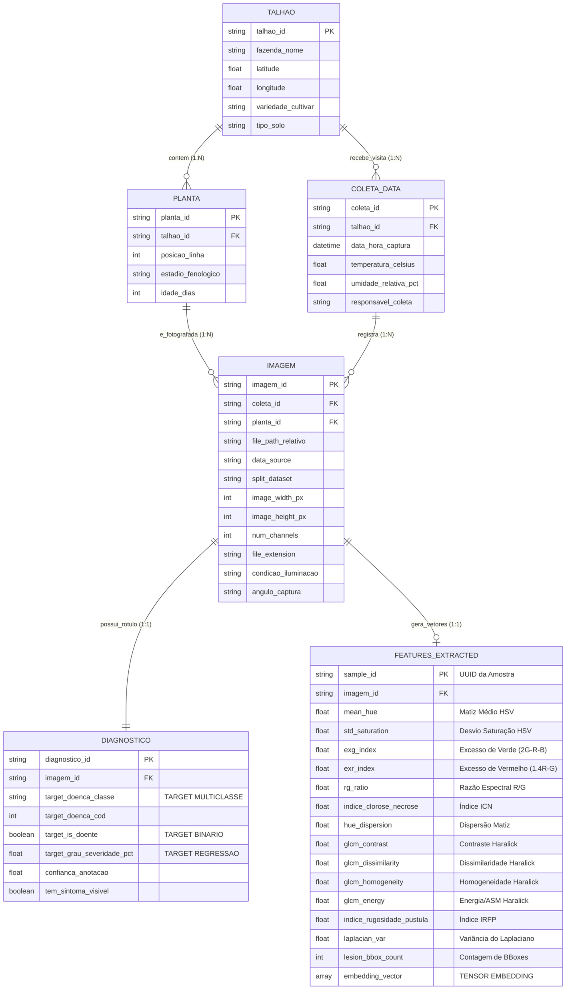
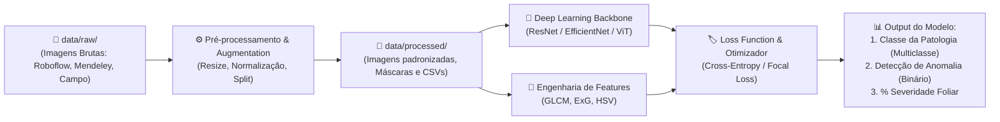

# 🏗️ Modelagem Conceitual de Entidades e Relacionamentos

**Projeto:** Sanidade-Vegetal (SugarVision)  
**Sprint:** 1 — Modelagem Inicial e Dicionário de Dados  

---

## 1. Visão Geral da Arquitetura de Dados

A modelagem de dados do ecossistema **SugarVision** foi desenhada para conectar o contexto agronômico de campo com a esteira de Visão Computacional e Aprendizado Profundo (*Deep Learning*).

As quatro entidades nucleares solicitadas pelo checklist — **`TALHAO`**, **`PLANTA`**, **`COLETA_DATA`** e **`IMAGEM`** — integram-se de forma consistente às entidades de inferência e aprendizado de máquina (**`DIAGNOSTICO`** e **`FEATURES_EXTRACTED`**).

---

## 2. Diagrama Entidade-Relacionamento (MER / DER)

---

## 3. Descrição Detalhada das Entidades e Cardinalidades

### 1. `TALHAO` (Área de Cultivo / Gleba)
* **Conceito:** Representa a unidade produtiva e geográfica delimitada dentro de uma fazenda ou usina canavieira.
* **Cardinalidade:** 
  * $1:N$ com `PLANTA` (um talhão contém múltiplas plantas/linhas).
  * $1:N$ com `COLETA_DATA` (um talhão passa por múltiplas campanhas de amostragem ao longo da safra).
* **Importância em Ciência de Dados:** Permite controlar o efeito de lote (*batch effect*), solo e variedade genética (*cultivar*), além de ser a unidade ideal para agrupamento (*GroupKFold*) para evitar vazamento de dados geográficos no treino de modelos.

### 2. `PLANTA` (Indivíduo Vegetal / Touceira)
* **Conceito:** A planta específica de cana monitorada no talhão.
* **Cardinalidade:** 
  * $N:1$ com `TALHAO`.
  * $1:N$ com `IMAGEM` (uma mesma planta pode ter fotos de diferentes folhas, faces adaxial/abaxial e diferentes ângulos).
* **Importância em Ciência de Dados:** Permite agregação temporal da evolução da sanidade da mesma planta ao longo dos dias.

### 3. `COLETA_DATA` (Evento Temporal de Monitoramento)
* **Conceito:** O registro da visita a campo ou voo de inspeção onde as fotos foram capturadas.
* **Cardinalidade:** 
  * $1:N$ com `IMAGEM` (uma única coleta produz centenas de registros fotográficos).
* **Importância em Ciência de Dados:** Agrupa condições microclimáticas (temperatura, umidade) que afetam tanto o desenvolvimento biológico de fungos/vírus quanto a qualidade visual da imagem (iluminação, reflexos de orvalho).

### 4. `IMAGEM` (Artefato Visual / Tensor Bruto)
* **Conceito:** O arquivo de imagem capturado (JPEG/PNG), seus metadados de aquisição e partição de treino.
* **Cardinalidade:**
  * $N:1$ com `COLETA_DATA` e $N:1$ com `PLANTA`.
  * $1:1$ com `DIAGNOSTICO`.
  * $1:1$ (ou $1:N$ por patch) com `FEATURES_EXTRACTED`.
* **Importância em Ciência de Dados:** Entrada principal (*input*) dos modelos de Visão Computacional (CNNs / Vision Transformers).

### 5. `DIAGNOSTICO` (Ground Truth / Rótulo de Treinamento)
* **Conceito:** O laudo fitopatológico emitido por especialistas ou extraído dos datasets benchmark (Roboflow e Mendeley Data).
* **Alvos Primários:**
  * Doença classificada (`Saudavel`, `Podridao_Vermelha`, `Mosaico`, `Ferrugem_Marrom`, `Mancha_Amarela`, `Carvao`).
  * Indicador binário (`target_is_doente`).
  * Percentual de severidade da área foliar lesionada.

### 6. `FEATURES_EXTRACTED` (Espaço de Características da Sprint 2)
* **Conceito:** Vetor numérico tabular multivariado extraído de cada imagem foliar, incorporando:
  * **Descritores Cromáticos:** Matiz Médio (`mean_hue`), Desvio de Saturação (`std_saturation`), Excesso de Verde (`exg_index`), Excesso de Vermelho (`exr_index`), Razão Espectral (`rg_ratio`), Índice de Clorose e Necrose (`indice_clorose_necrose`) e Dispersão de Matiz (`hue_dispersion`).
  * **Descritores Texturais Haralick (GLCM):** Contraste (`glcm_contrast`), Dissimilaridade (`glcm_dissimilarity`), Homogeneidade (`glcm_homogeneity`), Energia/ASM (`glcm_energy`) e Índice Composto de Rugosidade Foliar de Pústula (`indice_rugosidade_pustula`).
  * **Qualidade de Imagem:** Variância do Laplaciano (`laplacian_var`), dimensões e peso em disco.
* **Consolidação na ABT:** Todas essas variáveis unem-se aos targets (`class_label`, `target_binary`, `target_multiclass`) e metadados de particionamento (`split_partition`) no arquivo final `data/processed/abt_sanidade_vegetal.csv` (28 colunas), servindo como entrada direta para treinamento de Support Vector Machines (SVM) e modelos tabulares.

---

## 4. Fluxo de Dados e Armazenamento no Repositório

