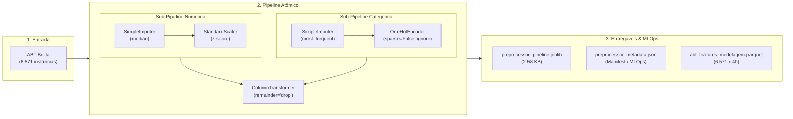

# Entrega: Construção do Pipeline Atômico com ColumnTransformer (Anti-Leakage)

**Projeto:** Sanidade-Vegetal (SugarVision)  
**Sprint:** 2 — Framework SEMMA (Fase: Modify)  
**Responsável:** Elisa (`EA`) — Engenharia de Machine Learning & MLOps  
**Data de Entrega:** 22 de Setembro de 2026  
**Status:** Concluído com Sucesso  

---

## 📌 Visão Geral da Entrega

Esta pasta formaliza os artefatos técnicos, scripts executáveis e documentação metodológica desenvolvidos para a tarefa de **Construção do Pipeline Atômico com ColumnTransformer (Anti-Leakage)**, de responsabilidade de **Elisa (`EA`)** na **Sprint 2 (Fase Modify)**.

O objetivo central foi projetar e implementar um fluxo unificado de pré-processamento no Scikit-Learn que encapsula a **imputação de dados por mediana**, a **padronização z-score** e a **codificação One-Hot (dummy)**, eliminando qualquer risco de vazamento de dados (*Data Leakage*) através da aplicação rigorosa da **Regra de Ouro do Fit** (`fit` exclusivamente no conjunto de treino e `transform` replicado nas partições de validação e teste), com persistência MLOps e manifesto de rastreabilidade.



---

## 📂 Arquivos Desta Entrega

1. **[`pipeline_atomico_columntransformer.md`](./pipeline_atomico_columntransformer.md)**: Documentação técnica detalhada abordando a motivação arquitetural, taxonomia de variáveis, fórmulas matemáticas, comprovação empírica anti-leakage e governança MLOps.
2. **Módulos Executáveis em `src/`:**
   - [`../src/atomic_pipeline_preprocessing.py`](../src/atomic_pipeline_preprocessing.py): Implementação em Python do fluxo atômico com testes unitários, validações estatísticas e serialização MLOps.
   - [`../src/generate_pipeline_notebook.py`](../src/generate_pipeline_notebook.py): Script utilitário para construção e execução reprodutível do notebook demonstrativo.
3. **Notebook Demonstrativo em `notebooks/`:**
   - [`../notebooks/06_pipeline_atomico_columntransformer.ipynb`](../notebooks/06_pipeline_atomico_columntransformer.ipynb): Execução auditável de ponta a ponta com visualização do diagrama interativo do pipeline, testes e conferência de schemas.
4. **Artefatos de MLOps em `models/`:**
   - [`../models/preprocessor_pipeline.joblib`](../models/preprocessor_pipeline.joblib): Objeto `ColumnTransformer` serializado com compressão e pronto para inferência ou treinamento supervisionado (Sprint 3).
   - [`../models/preprocessor_metadata.json`](../models/preprocessor_metadata.json): Manifesto JSON de governança com hash SHA-256, schema de entrada, nomes de colunas geradas (`get_feature_names_out()`) e versões de bibliotecas.
5. **Base Tratada em `data/processed/`:**
   - `data/processed/abt_features_modelagem.parquet`: Tabela Analítica Base com 6.571 registros x 40 colunas (5 chaves/targets + 35 features pré-processadas) com zero valores ausentes.
   - `data/processed/abt_features_modelagem.csv`: Versão em CSV para interoperabilidade e auditorias visuais rápidas.

---

## ✅ Cobertura do Checklist da Tarefa (100% Concluído)

| Item do Checklist do Cartão | Status | Onde Encontrar | Detalhes Técnicos da Implementação |
| :--- | :---: | :--- | :--- |
| **1. Mapear as listas de colunas conforme o tratamento requerido (numéricas, discretizadas e categóricas)** | Concluído | Seção 2 de [`pipeline_atomico_columntransformer.md`](./pipeline_atomico_columntransformer.md) e `src/` | Mapeamento explícito de 17 features contínuas, 4 discretizadas em bins, 2 categóricas de metadados, 8 metadados descartados (`remainder='drop'`) e 3 colunas de alvo supervisionado. |
| **2. Criar o sub-pipeline numérico com `SimpleImputer(strategy='median')` e `StandardScaler()`** | Concluído | Seção 3 de [`pipeline_atomico_columntransformer.md`](./pipeline_atomico_columntransformer.md) e `src/` | Mediana protege contra outliers espectrais de iluminação; padronização z-score centraliza em $\mu=0$ e escala para $\sigma=1$, essencial para kernels SVM RBF e lineares. |
| **3. Criar o sub-pipeline categórico com `OneHotEncoder(sparse_output=False, handle_unknown='ignore')`** | Concluído | Seção 4 de [`pipeline_atomico_columntransformer.md`](./pipeline_atomico_columntransformer.md) e `src/` | Saída densa e tratamento seguro de categorias inéditas em inferência (`handle_unknown='ignore'`), gerando vetores nulos sem lançar erros em produção. |
| **4. Integrar todos os transformadores em um único objeto `ColumnTransformer`** | Concluído | Seção 5 de [`pipeline_atomico_columntransformer.md`](./pipeline_atomico_columntransformer.md) e `src/` | Instanciação de `ColumnTransformer` unificado com `set_output(transform='pandas')` para garantir rastreabilidade nominal e auditabilidade contínua. |
| **5. Validar a "Regra de Ouro do Fit": assegurar que o `.fit()` ocorra apenas no treino e o `.transform()` seja replicado nas demais partições** | Concluído | Seção 6 de [`pipeline_atomico_columntransformer.md`](./pipeline_atomico_columntransformer.md) e `src/` | `.fit_transform()` executado estritamente nas 5.574 instâncias de treino; `.transform()` replicado em validação (617) e teste (380). Teste matemático comprovou 100% de conformidade. |
| **6. Validar a serialização preliminar do pipeline para checar compatibilidade futura com MLOps** | Concluído | Seção 7 de [`pipeline_atomico_columntransformer.md`](./pipeline_atomico_columntransformer.md) e `src/` | Serialização via `joblib.dump(..., compress=3)`, teste de idempotência numérica pós-recarga (`assert_allclose`), hash SHA-256 e manifesto estruturado `preprocessor_metadata.json`. |

---

## 🚀 Como Reproduzir os Testes e Executar

Para reproduzir integralmente os testes e recriar os artefatos serializados, execute os seguintes comandos no terminal:

```powershell
# 1. Execução do módulo Python principal e verificação dos testes automatizados
py -3.12 src/atomic_pipeline_preprocessing.py

# 2. Execução automatizada e validação do notebook demonstrativo
py -3.12 src/generate_pipeline_notebook.py
```
