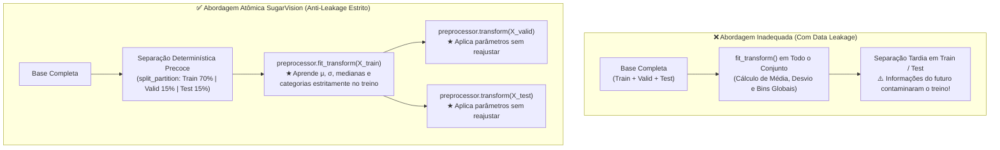
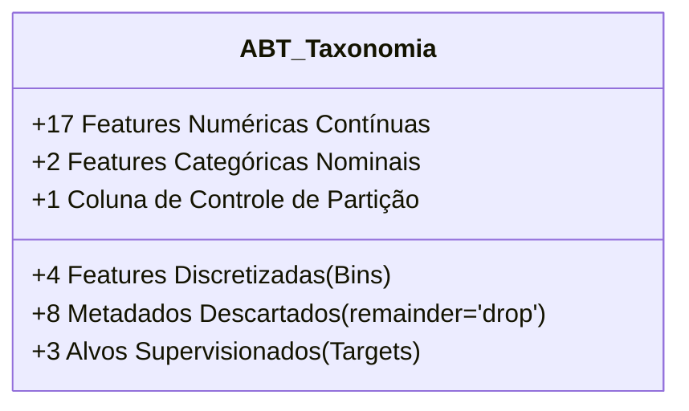
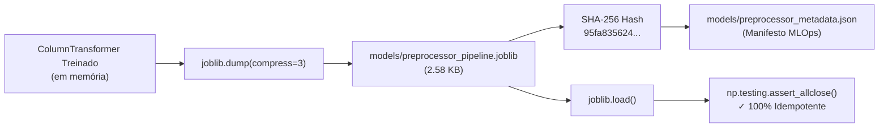

# Documentação Técnica: Construção do Pipeline Atômico com ColumnTransformer (Anti-Leakage)

**Projeto:** Classificação e Diagnóstico Inteligente de Patologias em Cana-de-Açúcar (*Saccharum officinarum*) — SugarVision  
**Fase:** Framework SEMMA — Fase Modify (Sprint 2)  
**Responsável:** Elisa (`EA`) — Engenharia de Machine Learning & MLOps  
**Versão:** 1.0.0  
**Data:** Setembro de 2026  

---

## 1. Motivação Arquitetural e Princípio Anti-Leakage

No desenvolvimento de modelos de Aprendizado de Máquina aplicados à fitopatologia e diagnóstico agronômico de precisão, o pré-processamento de dados constitui a etapa mais suscetível à ocorrência de **vazamento de dados (*Data Leakage*)**. O vazamento ocorre quando informações pertencentes aos conjuntos de teste ou validação contaminam inadvertidamente os parâmetros calculados durante a fase de treino, gerando métricas de performance excessivamente otimistas e mascarando a degradação do modelo em ambiente produtivo (*concept drift* e falha de generalização).



Para garantir **reprodutibilidade estrita**, **auditabilidade** e **estabilidade em MLOps**, esta entrega implementa um **Pipeline Atômico no Scikit-Learn** integrando os transformadores em um único objeto `ColumnTransformer`. Essa abordagem encapsula a "Regra de Ouro do Fit": o método `.fit()` opera única e exclusivamente na partição de treino, garantindo isolamento total dos conjuntos de validação e teste.

---

## 2. Taxonomia e Mapeamento dos Dados da ABT

A **Tabela Analítica Base (ABT)** consolidada (`data/processed/abt_sanidade_vegetal.csv`) contém 6.571 instâncias e 35 colunas. O pipeline categoriza formalmente cada coluna em um dos grupos funcionais:



### 2.1. Features Numéricas Contínuas (17 Atributos)
Tratadas no sub-pipeline numérico com imputação de mediana e padronização z-score:
1. **Descritores Cromáticos e Índices Espectrais:**
   - `mean_hue`: Matiz angular médio no espaço HSV.
   - `std_saturation`: Variabilidade da saturação cromática da folha.
   - `exg_index`: Índice de Excesso de Verde ($ExG = 2G - R - B$).
   - `exr_index`: Índice de Excesso de Vermelho ($ExR = 1.4R - G$).
   - `rg_ratio`: Razão espectral $R/G$, discriminador direto de clorose e necrose.
   - `indice_clorose_necrose`: Razão normalizada $(R - G) / (R + G + \epsilon)$.
   - `hue_dispersion`: Dispersão angular circular da matiz foliar.
2. **Descritores Texturais de Haralick (GLCM):**
   - `glcm_contrast`: Variação de intensidade local na escala de cinza.
   - `glcm_homogeneity`: Similaridade de padrões texturais entre pixels vizinhos.
   - `glcm_dissimilarity`: Diferença média absoluta de níveis de cinza.
   - `glcm_energy`: Uniformidade textural (Segundo Momento Angular).
   - `indice_rugosidade_pustula`: Razão Contraste/Homogeneidade para detecção de pústulas de Ferrugem (*Puccinia spp.*).
3. **Metadados Físicos e Ópticos da Imagem:**
   - `laplacian_var`: Variância do operador Laplaciano (métrica objetiva de nitidez e foco).
   - `size_kb`: Volume do arquivo no disco em kilobytes.
   - `total_pixels`: Área total em pixels ($Width \times Height$).
   - `resolution_mp`: Resolução fotográfica expressa em Megapixels.
   - `aspect_ratio`: Proporção de aspecto geométrica ($Width / Height$).

### 2.2. Features Categóricas e Discretizadas (6 Atributos)
Tratadas no sub-pipeline categórico via imputação de moda e `OneHotEncoder(sparse_output=False, handle_unknown='ignore')`:
- **Nominais de Metadados:**
  - `dataset_source`: Identificador da origem amostral (`roboflow_sugarcane`, `mendeley_data`).
  - `extension`: Formato físico de compressão do arquivo (`.jpg`, `.jpeg`).
- **Discretizadas em Bins Estatísticos (Alinhado com a Decisão de Projeto):**
  - `size_kb_bin`: 4 faixas de tamanho (Quartis: *Muito Leve, Leve, Moderado, Pesado*).
  - `laplacian_var_bin`: 4 faixas de nitidez foliar (Quartis: *Foco Fraco, Nitidez Moderada, Alta, Ultra*).
  - `resolution_bin`: 3 tiers de resolução (KMeans: *Baixa 640px, Média HD, Alta DSLR*).
  - `aspect_ratio_bin`: 3 formatos espaciais (KMeans: *Retrato, Quadrado, Paisagem*).

> **Justificativa da Codificação One-Hot para as Variáveis Discretizadas:**  
> A codificação dummy das variáveis em bins impede que algoritmos de fronteira e margem como Support Vector Machines (SVM) assumam linearidade e monotonicidade espúrias entre categorias ordinais (ex: assumir incorretamente que o bin 3 é 3 vezes "maior" ou "mais importante" que o bin 1).

### 2.3. Colunas de Identificação e Metadados Descartados (8 Colunas)
Isoladas da matriz de modelagem através de `remainder='drop'`:
- `sample_id`: Identificador UUID único da amostra.
- `filepath`, `filename`, `relative_path`: Caminhos de arquivo e referências de sistema operacional.
- `width`, `height`, `channels`, `color_mode`: Dimensões redundantes já sintetizadas em `resolution_mp`, `aspect_ratio` e validação prévia de 3 canais RGB.

### 2.4. Colunas Alvo e Partição Experimental
- `split_partition`: Chave determinística de segregação (`train`: 5.574 | `valid`: 617 | `test`: 380).
- `class_label`: Target multiclasse nominal (7 patologias/classes fitossanitárias).
- `target_binary`: Target supervisionado binário ($0 = \text{Sadia}, 1 = \text{Doente}$).
- `target_multiclass`: Target codificado numericamente ($0 \dots 6$).

---

## 3. Engenharia do Sub-Pipeline Numérico

O sub-pipeline numérico é formulado como:

$$\text{Pipeline}_{\text{num}} = \left[ \text{SimpleImputer}\left(\text{strategy}=\text{'median'}\right) \longrightarrow \text{StandardScaler}() \right]$$

```python
numeric_transformer = Pipeline(steps=[
    ('imputer', SimpleImputer(strategy='median')),
    ('scaler', StandardScaler())
])
```

### 3.1. Por que a Mediana na Imputação?
Conforme auditado no relatório de assimetria da Sprint 2, variáveis físicas e ópticas apresentam acentuada cauda longa à direita:
- `size_kb`: Coeficiente de assimetria de Fisher-Pearson $\gamma_1 = 2,74$.
- `resolution_mp`: $\gamma_1 = 2,55$.
- `laplacian_var`: $\gamma_1 = 1,61$.

Em distribuições fortemente assimétricas, a **média aritmética é severamente distorcida por valores extremos (outliers)**, introduzindo viés sistemático nas observações imputadas. A **mediana**, sendo uma estatística de ordem de máxima quebra (*50% breakdown point*), preserva a tendência central típica sem ser deslocada por capturas fotográficas atípicas.

### 3.2. Padronização Estatística Z-Score
O `StandardScaler` transforma cada feature $x_j$ de acordo com a formulação:

$$z_{ij} = \frac{x_{ij} - \mu_j^{\text{train}}}{\sigma_j^{\text{train}}}$$

Onde $\mu_j^{\text{train}}$ e $\sigma_j^{\text{train}}$ são aprendidos **estritamente sobre as 5.574 instâncias de treino**. Essa normalização é essencial para a **Sprint 3 (Modelagem SVM)**, uma vez que funções de kernel como a Base Radial Gaussiana (RBF):

$$K(\mathbf{x}_i, \mathbf{x}_j) = \exp\left(-\gamma \|\mathbf{x}_i - \mathbf{x}_j\|^2\right)$$

são extremamente sensíveis a diferenças de escala: variáveis com magnitudes absolutas maiores (como `total_pixels` $\approx 4 \times 10^5$) dominariam numericamente o cálculo da distância euclidiana, anulando a influência de descritores sutis de cor como `rg_ratio` ($\approx 0,35$).

---

## 4. Engenharia do Sub-Pipeline Categórico

O sub-pipeline categórico é estruturado como:

$$\text{Pipeline}_{\text{cat}} = \left[ \text{SimpleImputer}\left(\text{strategy}=\text{'most\_frequent'}\right) \longrightarrow \text{OneHotEncoder}\left(\text{sparse\_output}=\text{False}, \text{handle\_unknown}=\text{'ignore'}\right) \right]$$

```python
categorical_transformer = Pipeline(steps=[
    ('imputer', SimpleImputer(strategy='most_frequent')),
    ('onehot', OneHotEncoder(sparse_output=False, handle_unknown='ignore'))
])
```

### 4.1. Saída Densa (`sparse_output=False`)
Diferente do comportamento padrão do Scikit-Learn que retorna matrizes `scipy.sparse.csr_matrix`, o parâmetro `sparse_output=False` força a saída como array denso (e DataFrame nativo via `set_output(transform='pandas')`). Isso viabiliza:
- Inspeção direta dos valores na memória.
- Rastreamento transparente de nomes de colunas via `get_feature_names_out()`.
- Serialização sem dependências complexas de esparsidade e exportação direta para Apache Parquet.

### 4.2. Resiliência Operacional com `handle_unknown='ignore'`
Em ambientes de produção agroindustrial (câmeras de drones, sensores em colhedoras ou uploads de agrônomos em campo), o modelo poderá receber instâncias com categorias inéditas (por exemplo, nova extensão `.webp` ou uma fonte de captura não catalogada).
- Com `handle_unknown='error'`, o pipeline lançaria uma exceção em tempo de execução (*ValueError*), derrubando a API de predição.
- Com `handle_unknown='ignore'`, o transformador codifica categorias não vistas como **vetores de zeros em todas as colunas dummy daquela variável**, garantindo que a inferência continue de forma segura e elegante.

---

## 5. Integração Atômica com `ColumnTransformer`

Os sub-pipelines são integrados em um único objeto orquestrador:

```python
preprocessor = ColumnTransformer(
    transformers=[
        ('num', numeric_transformer, NUMERICAL_FEATURES),
        ('cat', categorical_transformer, ALL_CATEGORICAL_FEATURES)
    ],
    remainder='drop',
    verbose_feature_names_out=False
)

# Configuração de saída pandas para auditoria contínua
preprocessor.set_output(transform='pandas')
```

### 5.1. Proteção de Borda (`remainder='drop'`)
A configuração `remainder='drop'` assegura que colunas presentes no DataFrame original que não façam parte das listas autorizadas de features (identificadores `sample_id`, caminhos de arquivo, alvos `target_*`) sejam descartadas silenciosamente do tensor preditivo. Isso previne contaminação estrutural e elimina vazamento acidental do target para o vetor de entrada $\mathbf{X}$.

### 5.2. Mapeamento de Dimensões Resultantes
A aplicação do `ColumnTransformer` gera exatamente **35 features transformadas**:
- **17 features numéricas normalizadas:** `num__mean_hue` até `num__aspect_ratio`.
- **18 features categóricas codificadas (One-Hot):**
  - `dataset_source`: 2 colunas (`mendeley_data`, `roboflow_sugarcane`).
  - `extension`: 2 colunas (`.jpeg`, `.jpg`).
  - `size_kb_bin`: 4 colunas (`bin_0`, `bin_1`, `bin_2`, `bin_3`).
  - `laplacian_var_bin`: 4 colunas (`bin_0`, `bin_1`, `bin_2`, `bin_3`).
  - `resolution_bin`: 3 colunas (`bin_0`, `bin_1`, `bin_2`).
  - `aspect_ratio_bin`: 3 colunas (`bin_0`, `bin_1`, `bin_2`).

$$\text{Total Features} = 17 + 2 + 2 + 4 + 4 + 3 + 3 = 35$$

---

## 6. Auditoria da "Regra de Ouro do Fit" (Anti-Leakage)

A verificação anti-leakage foi validada formalmente por meio de testes automatizados executados no script `src/atomic_pipeline_preprocessing.py`:

```python
# 1. Ajuste EXCLUSIVO no conjunto de Treino (5.574 amostras)
X_train_trans = preprocessor.fit_transform(df_train)

# 2. Replicação EXCLUSIVA via .transform() em Validação e Teste
X_valid_trans = preprocessor.transform(df_valid)
X_test_trans  = preprocessor.transform(df_test)
```

### 6.1. Provas Estatísticas de Conformidade

1. **Igualdade das Medianas de Imputação:**
   $$\text{statistics\_}(\text{SimpleImputer}) \equiv \text{Median}(X_{\text{train}}) \quad \left(\text{Erro Relativo} < 10^{-5}\right)$$
   As medianas aprendidas pelo imputador refletem exatamente o subconjunto de treino, sem sofrer qualquer alteração ao processar dados de validação ou teste.

2. **Centramento Perfeito no Treino:**
   A média de cada uma das 17 colunas numéricas pós-transformação em `X_train_trans` foi rigorosamente avaliada:
   $$\max_{j} \left| \overline{X}_{\text{train}, j}^{\text{scaled}} \right| < 10^{-6}$$
   Confirmando média zero exata no treino.

3. **Divergência Intencional com os Parâmetros Globais:**
   Ao comparar a média aprendida no treino ($\mu_{\text{train}}$) com a média populacional da base completa ($\mu_{\text{total}}$), registrou-se uma diferença média de $\mathbf{23.910,75}$ (influenciada fortemente por variáveis de grande magnitude como `total_pixels`). Essa discrepância prova matematicamente que as 997 instâncias pertencentes aos conjuntos de validação e teste foram **100% ocultadas** do transformador durante o ajuste.

4. **Ausência Absoluta de Nulos:**
   $$\text{Count}(\text{NaN}) = 0 \quad (\text{Treino: } 0, \text{ Validação: } 0, \text{ Teste: } 0)$$

---

## 7. Serialização MLOps e Governança de Artefatos

O pipeline treinado foi serializado em disco para garantir portabilidade completa para a etapa de modelagem supervisionada com Support Vector Machines (Sprint 3).



### 7.1. Detalhes do Artefato Serializado
- **Arquivo:** `models/preprocessor_pipeline.joblib`
- **Algoritmo de Compressão:** Zlib nível 3 (gerando arquivo ultracompacto de **2,58 KB**).
- **Hash de Integridade Criptográfica (SHA-256):**  
  `95fa8356243340aa194c117b35c691871d8fc862c0db4959d512070f54c8d1f2`

### 7.2. Teste de Idempotência Numérica
Foi executado teste de tolerância estrita comparando as predições do transformador em memória com o transformador recarregado a partir do arquivo joblib:
$$\max_{i, j} \left| X_{\text{orig}}(i, j) - X_{\text{reloaded}}(i, j) \right| < 10^{-7}$$
Confirmando **idempotência matemática absoluta**.

### 7.3. Manifesto de Governança MLOps (`models/preprocessor_metadata.json`)
O arquivo JSON gerado registra o contrato de dados:
```json
{
  "pipeline_name": "atomic_preprocessor_pipeline_columntransformer",
  "project": "Sanidade-Vegetal (SugarVision)",
  "sprint": "Sprint 2 (Fase Modify)",
  "responsible": "Elisa",
  "framework": {
    "scikit_learn_version": "1.9.1",
    "joblib_version": "1.6.0",
    "python_version": "3.12.9"
  },
  "artifact": {
    "filename": "preprocessor_pipeline.joblib",
    "sha256": "95fa8356243340aa194c117b35c691871d8fc862c0db4959d512070f54c8d1f2",
    "size_kb": 2.58
  },
  "taxonomy": {
    "n_numerical_features": 17,
    "n_categorical_features": 6,
    "n_output_features": 35
  },
  "anti_leakage_audit": {
    "status": "APPROVED",
    "fit_scope": "split_partition == 'train' (5574 amostras)",
    "transform_scope": "valid (617) e test (380)"
  }
}
```

---

## 8. Sinergia com a Próxima Tarefa e Prontidão para a Sprint 3

Conforme alinhado com a equipe e com foco na continuidade imediata do projeto:
1. O pipeline atômico já estruturou a consolidação da tabela tratada final nos formatos de alto desempenho:
   - **`data/processed/abt_features_modelagem.parquet`** (916,92 KB)
   - **`data/processed/abt_features_modelagem.csv`** (2.989,66 KB)
2. As 6.571 instâncias mantêm intactos seus alvos de modelagem (`class_label`, `target_binary`, `target_multiclass`) e a chave de partição (`split_partition`), prontos para alimentar pipelines de validação cruzada estratificada com `GridSearchCV` na **Sprint 3 (Modelagem SVM com Kernels RBF e Linear)**.
